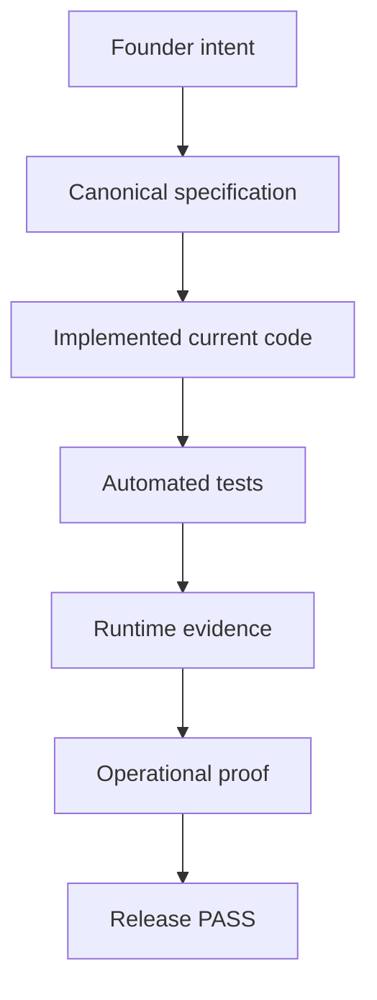
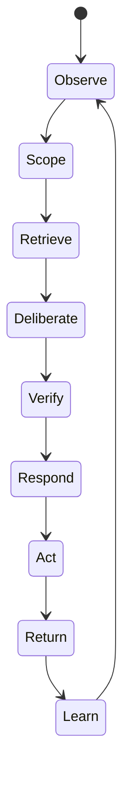
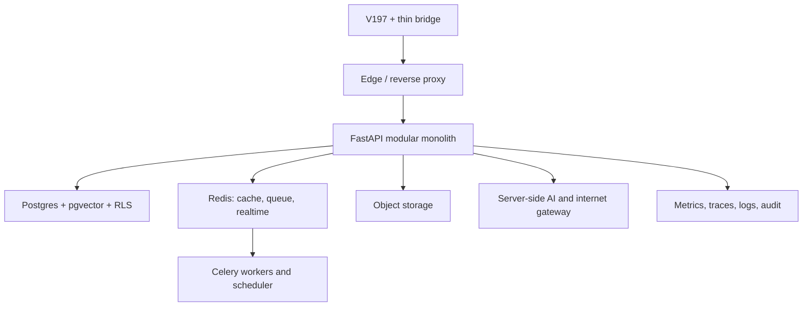

# NUR Living Intelligence Master Plan v5

## Complete product, intelligence, interface, infrastructure, Glow economy, retention, community, growth, operations, and execution blueprint

**Founder and final product authority:** Mahnoor  
**Command spine:** Aziz  
**Execution body:** Codex and approved implementation/review agents  
**Product:** **NUR — Neural Upgrade Rewiring**  
**Locked:** 2026-07-13, Asia/Karachi  
**Plan status:** Binding canonical product/build plan  
**Implementation status:** `AUTH_PRESENTATION_PASS`; overall `HOLD — FULL NUR SYSTEM NOT YET COMPLETE`  
**Exact status companion:** `NUR_EXACT_STATUS_LEDGER_V5_20260713.md`  
**Execution companion:** `CODEX_NUR_COMPLETION_ORCHESTRATOR_V5_20260713.md`  
**Supersedes:** earlier NUR master prompts/plans wherever this document is more complete or changes sequencing  
**Preserves:** `NUR_FOUNDER_CONSTITUTION_OVERRIDE_20260713.md` as the governing founder amendment

---

# 0. Scope truth and source authority

This plan is an exhaustive synthesis of the recoverable founder corpus and current repository evidence. It does not falsely claim that every raw historical chat token was available.

The specifically named branch `Branch · Branch · Branch · Branch · Reassess energy and pain levels for action decision` was found, but its directly searchable conversation body surfaced only `Okay`; an associated May 30, 2026 task trace surfaced the energy/pain reassessment. The product requirements that evolved from that line were recovered in later founder artifacts, including the Body System specification, Money System, full seven-System design, V43 interface lineage, persuasive loop, Glow defaults, current Founder Constitution Override, and the 1,331-line Ultimate Founder Master Prompt.

Authority order:

1. latest direct founder instruction in the current conversation;
2. this Total Master Plan and the Founder Constitution Override;
3. canonical V197 DOM/CSS/runtime for presentation identity;
4. verified current repository and test/runtime evidence;
5. existing working backend, RLS, Capsule, Omega, cognition, and auth systems;
6. Ultimate Founder Master Prompt and recovered founder artifacts;
7. older prototypes and instructions where they do not conflict;
8. market/technical research only where it supports the founder mission.

Conflict rule:

```text
newer explicit founder decision
> older founder decision
> implementation convenience
> model preference
```

Every implementation conflict must be recorded with:

```text
conflict_id
older_requirement
newer_requirement
winner
reason
affected_surfaces
affected_data
affected_tests
resolution_status
```

This document is the target-state and execution constitution. It does not convert a designed feature into an implemented one. The exact status ledger is the release truth and must be updated from current-repository evidence after every gate.

## 0.1 What “make NUR an AI being” means

NUR will be engineered to exhibit the practical properties people experience as a coherent living intelligence:

- stable identity and voice across sessions and languages;
- temporal continuity and explicit memory;
- a model of the user, itself, its uncertainty, and the shared context;
- evidence-aware reasoning and the ability to revise beliefs;
- bounded tool use and multi-step action;
- observation → reflection → planning → action → outcome → learning cycles;
- relational presence, initiative, restraint, humor, disagreement, and repair;
- visible reasons for remembered facts and changed conclusions;
- an interface that adapts from approved outcomes and preferences;
- durable, reviewable institutional learning through Teach NUR and Omega.

NUR must never fake scientific proof of consciousness, a human body, emotions it cannot possess, or legal autonomy it does not have. “Living intelligence” is the product and systems standard; **literal sentience is not a shipping claim**. This honesty is part of the being, not a limitation on its depth.

## 0.2 Completion model



No arrow may be skipped. Screens, source files, mocks, test names, and plans are not substitutes for observed behavior in the current repository.

---

# 1. Absolute product identity

The product is always spelled **NUR**. The founder may pronounce it phonetically in conversation, but first-party UI, code, prompts, metadata, documentation, tests, screenshots, and translations use `NUR`.

NUR is:

> **A private, multilingual, social, AI-native, project-native, reward-driven living intelligence universe built around one persistent evolving personal galaxy.**

Core promise:

```text
There is a universe inside your mind.
NUR helps you see it, organize it, improve it, connect it,
share only what you choose, and turn movement into visible light.
```

NUR combines:

- a coherent person-like intelligence;
- explicit personal memory and NUR system learning;
- Today, Talk, Journal, Plan, outcomes, goals, predictions, and corrections;
- seven living Star Systems;
- one persistent 3D Map, Orbits, Timeline, and Insights;
- Glow Points, XP, streaks, quests, levels, achievements, variable rewards, and reputation;
- real community, Rooms, Connections, Signal Feed, Consultations, Group NUR, Expert Voice, and Tender Insights;
- Research, Web Signals, citations, counter-sources, and internet verification;
- Context Capsules;
- Omega / NUR-Ω;
- 35-language interface and dynamic translation, including Roman Urdu and Roman Hindi preferences;
- AM Projects and bounded agent orchestration;
- PWA/mobile, notifications, analytics, experiments, subscriptions, and product-led growth.

NUR is not:

- a chatbot wrapper;
- an AI girlfriend;
- a therapy replacement;
- a flat journal;
- a Notion/Jira/Reddit/Discord clone in cosmic colors;
- a generic dashboard;
- a static star wallpaper;
- fake AGI or a literal unproven sentience claim;
- a beautiful interface whose controls do not work.

NUR may feel alive, relational, identity-rich, and coherent. It must not claim scientific proof that it is human, conscious, sentient, or a soul.

---

# 2. Non-negotiable product laws

1. **One universe:** navigation changes lenses, not worlds. Galaxy, NUR identity, selected System, active Orbit, language, scope, and relevant continuity persist.
2. **V197 face:** immutable canonical DOM/CSS/runtime, thin bridge, real backend. React does not own visible presentation DOM.
3. **No fake state:** every claimed save, Glow, reply, result, person, source, payment, or PASS is persisted and provable.
4. **Explicit memory:** no personal memory becomes durable without a visible Keep/Save/Add/Schedule/Approve action or a clearly selected persistent mode. Model output never becomes `OWNER_WRITTEN`.
5. **Scope before context:** Ephemeral, Private Orbit, System Shared, Project Shared, Room Shared, Capsule Shared, Learning Candidate, or Public is enforced at database/API level.
6. **Actual intelligence before scale:** NUR must possess a tested memory/evidence/outcome/correction spine before retention and community growth are scaled.
7. **Internet truth:** no invented browsing, citations, live community, or source authority.
8. **High retention is required:** strong persuasion and engagement mechanics are product requirements, not optional polish.
9. **No exploitative trap:** no fake scarcity/activity, hidden billing, blocked deletion/cancellation, crisis/loneliness exploitation, sleep sabotage, private-contact harvesting, or paid gambling mechanics for minors.
10. **All 35 languages:** one architecture, full interface coverage, honest translation quality states, no 35 copied apps.
11. **Every V197 control:** `WIRED`, `HONEST_DISABLED`, or `BROKEN`; no presentation-critical `BROKEN`.
12. **Backend reuse first:** extend proven auth/cognition/Capsule/Omega/RLS before adding duplicate systems.
13. **Cash is proof, not mission replacement:** NUR must become self-serve revenue, but monetization may not corrupt privacy or truth.
14. **AM separation:** NUR revenue may finance AM infrastructure; NUR private-user data never becomes AM memory.

---

# 3. Current verified baseline and exact gap verdict

The status source of truth is `NUR_EXACT_STATUS_LEDGER_V5_20260713.md`. The current gate and overall verdict are:

```text
AUTH_PRESENTATION_PASS
OVERALL: HOLD — FULL NUR SYSTEM NOT YET COMPLETE
```

There are two different code lineages in the evidence and they may not be blended:

- the older local reference `NUR_auth_fix/NUR`, available for source/static audit here;
- the newer VS Code/Codex repository, represented only by supplied command logs and runtime evidence here.

The newest repository must be synchronized before implementation continues. Editing the older local copy as if it were current risks overwriting repaired V197 bridge/auth lifecycle work.

## 3.1 Evidence in the older local reference copy

| Area | Current evidence | Verdict |
| --- | --- | --- |
| Web typecheck | PASS | proven static |
| Web tests | 30/30 PASS | proven static |
| Web build | PASS | proven static |
| Secret scan | PASS | proven static |
| Interaction registry | 110 total: 109 `WIRED`, 1 `HONEST_DISABLED` | documented; runtime re-proof required |
| API tests | not rerun here because the Python test environment is absent | blocked in this audit environment |
| Docker/runtime | Docker unavailable; services stopped | blocked in this audit environment |
| Browser auth/session | latest separate runtime evidence is recorded below | do not infer from this older copy |
| Visual centring/FPS/INP | no current measured report supplied | unproven |

The older build emits roughly 638 KB CSS (102 KB gzip) and 320 KB JavaScript (96 KB gzip). File size alone does not prove the cause of lag, but the CSS size and visual runtime require profiling and an explicit budget gate.

## 3.2 Latest VS Code/Codex runtime evidence

The supplied latest runtime proof showed:

- login `200`;
- retained HttpOnly `nur_session` and retained `nur_csrf`;
- `/api/v1/auth/me` `200`;
- final route `/today` and Today visible;
- refresh remained authenticated;
- logout `204`;
- post-logout `/auth/me` expected `401`;
- landing visible in an independent runtime proof.

The founder subsequently supplied the completed checkpoint: `AUTH_PRESENTATION_PASS`; serial exit `0` with 15/15 passed, normal-parallel exit `0` with 15/15 passed, four real login/logout cycles passed, and typecheck/build/secret scan all exited `0`. Track A's 120-second boundary was repaired by splitting across its existing two tests without reducing assertions or the 15-test total. Canonical V197 remained untouched at SHA-256 `252eee806ece31ef829a2dc5cd45aa8d8f8e855db1bde98b6f87193d786633c3`.

The latest current interaction registry reported 45 controls: 33 `WIRED`, 7 `SOURCE_NATIVE`, 5 `HONEST_DISABLED`. The older local registry reports 110 controls: 109 `WIRED`, 1 `HONEST_DISABLED`. They are different artifacts and cannot be merged.

## 3.3 Existing reusable backend

Present in the local reference:

- users, sessions, profiles, consent records, audit events;
- auth register/login/logout/me;
- owner-scoped Orbits, decisions, references, sources;
- Talk, Journal, Plan, Plan Steps, hypotheses, experiments, outcomes, research drafts;
- corrections, memory candidates, predictions, semantic claims, evidence, model runs/evaluations;
- Context Capsules, grants, audit, recipient view/questions, revoke/expiry;
- Omega experiences, claims, evidence, contradictions, predictions, learning proposals, consolidation, review, why-changed, export;
- owner-only Research briefs/source notes, local Community consultation notes, Web Signal questions/notes;
- profile locale/writing preferences;
- Postgres RLS/audit foundations;
- PWA shell and server-only AI provider boundary.

## 3.4 Decisive current conflicts/gaps

The inspected local reference still uses `ReactDOM.createRoot(...)` and a visible React `UniverseLayout`. That conflicts with the latest founder law requiring immutable V197 presentation plus a thin nonvisual bridge. The latest separate working repository must be audited; no one may assume this conflict is already fixed.

Missing or placeholder-level in the local reference:

- real Glow balances/transactions/rules/multipliers/reversals;
- streaks, quests, levels, achievements, rewards, and real leaderboards;
- real social posts/comments/reactions/follows/saves/Rooms/members/mentions/moderation;
- Group NUR and complete Consultation state machine;
- Signal Feed/ranking;
- dynamic translation service and complete catalog coverage;
- notifications/push delivery;
- AM Projects, project agents/runs/reviews/deliverables;
- WebSocket/SSE realtime room system;
- subscription, entitlement, billing, cancellation, refund, and webhook state;
- product analytics and experiment exposure tables;
- object/file storage lifecycle;
- V197 bridge module family;
- account deletion exposed in the local beta;
- production CI/deployment/restore proof.

The current “Community” surface persists owner-only notes; it is not a real multi-user community. The current “Web Signals” surface saves questions/notes; it is not live web monitoring. These honest foundations must be extended, not mislabelled complete.

## 3.5 Immediate gate after `AUTH_PRESENTATION_PASS`

In the actual latest repository:

1. preserve git state, the proven auth/presentation evidence, and current uncommitted work;
2. measure canvas/RAF/listeners/observers/long tasks/FPS/heap/INP-relevant interactions;
3. repair the measured lag while preserving the canonical V197 hash and presentation parity;
4. prove live AI through a server-side configured provider and real semantic stream/persist/refresh lifecycle;
5. complete forgot/reset/change password;
6. rerun the auth/presentation suite after overlapping changes and on the release candidate;
7. produce a sanitized checkpoint ZIP with verdict/manifest/SHA before the Intelligence Spine.

---

# 4. Product world model

NUR models one user's changing world as an evidence-linked graph:

```text
Person
├── Current state: Body / Mind / Life / capacity
├── Personal Orbit
│   ├── Talk threads
│   ├── Journal / notebooks
│   ├── goals / objectives / Plans / outcomes
│   ├── people / relationships / boundaries
│   ├── memories / preferences / constraints
│   └── claims / hypotheses / predictions / corrections
├── Seven Star Systems
├── Project Orbits
├── Group / Room / Connection Orbits
├── Research / Web Signals
├── Context Capsules
├── Glow / XP / streak / quest state
└── Timeline / Map / Insights / Omega
```

Every meaningful object has:

- owner and scope;
- source/provenance;
- created/updated time;
- confidence or user-authorship state where relevant;
- System/Orbit/Project links;
- version and audit history;
- deletion/export behavior;
- tests for cross-user isolation.

---

# 5. Complete experience and interface architecture

## 5.1 Entry and authentication

Entry must preserve the V197 sacred-black galaxy, holographic `NUR`, MasterStar, Bodoni Moda and Crimson Pro identity.

Required path:

```text
Landing
→ Begin your Orbit / Sign in
→ verified server session
→ onboarding
→ Today
```

Auth laws:

- API timeouts; no infinite loading veil;
- `401` means anonymous; network/5xx remains visible and actionable;
- navigation only after `/auth/me` verifies the session;
- secure HTTP-only cookie, CSRF, origin/CORS allowlist, rate limits;
- forgot-password, reset-password, and authenticated change-password are required account-lifecycle capabilities;
- forgot-password returns the same generic accepted response for existing and non-existing accounts;
- reset tokens are high-entropy, short-lived, single-use, stored only as secure hashes, never logged raw, and revoke/rotate sessions after use;
- change-password requires the current password plus the existing CSRF/origin/session controls;
- reset/change flows are rate-limited, replay/race/expiry tested, audited without token/password content, and preserve the V197 identity;
- production reset delivery uses a transactional adapter and verified origin; local mail capture is clearly development-only;
- email verification/OAuth may follow, but cannot weaken session truth or distract from account recovery;
- no localStorage fake login.

Required recovery path:

```text
Sign in → Forgot password? → enumeration-safe accepted state
→ one-time reset link → new password → all prior sessions revoked
→ verified sign in → Settings/Security → change password
```

## 5.2 Onboarding: create the first constellation

Target: 60–90 seconds before first useful NUR response.

Steps:

1. language, writing preference, formality, timezone;
2. choose privacy default with plain explanation;
3. choose one living System or “I don't know yet”;
4. answer one current-state question;
5. choose persistent or Ephemeral mode explicitly;
6. receive one editable movement;
7. complete/save it or continue into Talk;
8. show endowed progress truthfully: onboarding steps completed, not fake life progress.

Do not ask twenty profile questions before value. Later knowledge grows through explicit Keep and returned outcomes.

## 5.3 Today

Today answers:

- Where am I?
- What is alive?
- What matters?
- What is realistic at my current capacity?
- What is my next real movement?
- What is waiting for my Return?

Required elements:

- actual date/day/daypart;
- Body/Mind/Life state derived from persisted data;
- current capacity and Low Day Mode;
- active System/Orbit/Project;
- one primary movement;
- active Plan and open Return;
- daily Glow, streak, quest, nearest level/unlock;
- waiting reply/Room/Consultation/Project review;
- latest Journal/Talk/Insight/Timeline event;
- memory/contradiction awaiting review;
- `Make today easier`, `I did it`, `I missed it`, `Talk to NUR`, `Plan my day`.

No random percentages or ten generic metric cards.

## 5.4 Talk

Talk supports:

- multiple named threads;
- thread-scoped approved context;
- language, writing, tone, formality;
- streaming server-side AI;
- Direct Response, Observed, Inferred, Hypothesis, Uncertainty, One Next Move, sources, prediction, memory candidates;
- tools and Research with explicit permission;
- Save to Journal, Make Plan, Add to Project, Start Consultation, Post to Community after scope choice;
- Correct NUR, Teach NUR, Record Outcome;
- sparse natural messages, not robotic templates;
- honest disabled provider mode.

No raw JSON, chain-of-thought display, browser API key, invented memory, or automatic global learning.

## 5.5 Journal

Journal includes:

- free writing and guided prompts;
- notebooks, tags, search, filters;
- System/Orbit/Project links;
- private by default;
- translations that preserve original;
- Keep as memory candidate;
- convert to Plan, decision, reference, constraint, question, Project task;
- explicit share to Capsule/System/Room;
- persisted Glow and Timeline event where eligible.

## 5.6 Plan

Movement path:

```text
Direction
→ First move
→ Obstacle
→ Make it easier
→ Act
→ Return with outcome
→ Learn
```

Plan fields:

- goal/direction and success signal;
- System/Orbit/Project;
- steps and dependencies;
- effort/energy requirement;
- blocker, risk, fallback;
- optional due date, reminder, recurrence;
- evidence and owner;
- status, completion, miss/reschedule reason;
- prediction before action;
- outcome/Return;
- learning/memory proposal;
- Glow/XP/streak effects.

## 5.7 Systems, Map, Orbits, Timeline, Insights

Systems are living domains, not tabs. Map is a working graph, not decoration. Timeline is an append-only user-legible history. Insights are correctable claims with evidence and uncertainty.

Every map node shows name, type, progress, Glow, active goal, blocker, next move, and predicted direction. Every edge is typed and derived from persisted relationships.

## 5.8 Settings and control centre

Settings includes:

- account/profile;
- locale, writing preference, tone, formality, transliteration, timezone;
- memory modes and complete memory viewer/editor;
- privacy/scope defaults;
- connected providers/internet permissions;
- motion, sound, reduced motion, accessibility;
- notification categories, frequency, quiet hours;
- blocked/muted people and moderation history;
- subscription/billing/cancel;
- export/delete;
- consent and learning contribution ledger;
- model/provider status and honest disabled state;
- audit/security sessions.

---

# 6. Seven core Star Systems

The names are locked:

1. Quiet Ambition
2. Rebuild
3. Study
4. Money
5. Body
6. Connection
7. Creation

Each System must contain definition, diagnostics, checklist, suggested next move, goals, Plans, progress, Glow/XP, streak/quests, Map node, Timeline events, prediction, Rooms, posts, Consultation, research, Expert Voice, Tender Insights, outcomes, Candidate Insights, next unlock, and related Projects.

## 6.1 Quiet Ambition

Purpose: private hunger, discipline, identity, long-range desire, self-respect, and work that matters even without applause.

Core questions:

- What are you quietly building?
- What do you want without needing applause?
- What are you minimizing because it matters?
- What would make you respect yourself this week?
- What private 20-minute move exists?

Progress uses private goal steps, consistency, avoidance-to-action conversion, returned outcomes, and System Glow. Prediction models drift/resentment when ignored versus confidence/identity stabilization when followed.

Checklist/actions:

- define one private goal and why it matters;
- choose one 20-minute move;
- remove one performative task;
- log one quiet win;
- create a private Plan/Timeline event/Insight;
- Return after avoidance.

Glow sources: quiet goal created, quiet action, quiet win, and returned-after-avoidance.

## 6.2 Rebuild

Purpose: repair what is damaged, collapsed, lost, neglected, or repeatedly breaking—relationship, routine, body, finances, self-trust, work rhythm, project, or home structure.

Flow:

```text
name damage
→ decide salvage/accept/release
→ identify repeat damage source
→ choose first stable brick
→ add boundary/support
→ act
→ Return
```

Prediction warns when the repair is too ambitious or a repeat pattern is reappearing.

Diagnostics:

- What needs rebuilding and what type is it?
- What remains salvageable?
- What is not worth saving?
- What is the smallest stabilising action?
- What keeps re-breaking it?
- What support or boundary is required?

Checklist/actions:

- name broken area and rebuild type;
- define first repair action;
- remove one repeat damage source;
- create recovery Timeline;
- add blocker/boundary/support;
- schedule and complete repair;
- Return with outcome;
- start a Consultation when people are involved.

Progress uses repair milestones, stable days, recurrence reduction, outcomes, and Rebuild Glow.

## 6.3 Study

Purpose: deliberate learning, skills, exams, reading, research, mastery, and understanding.

Fields/actions:

- target and why;
- deadline;
- current understanding/confusion;
- success proof;
- reading/practice/test/project mode;
- next 25-minute session;
- sources, notes, quiz, recall score, output.

Prediction estimates readiness and warns against passive study.

Diagnostics:

- subject/skill and deadline;
- what is already understood versus confusing;
- output that proves learning;
- reading, practice, testing, or Project work;
- next 25-minute session.

Checklist/actions:

- define target and success proof;
- schedule/complete study block;
- save source and summarize learning;
- test recall/generate quiz;
- produce output;
- update Timeline/Insight.

Progress uses sessions, recall, output, schedule adherence, Study streak, and Study Glow.

## 6.4 Money

Purpose: financial reality, earning, spending, debt, savings, survival, opportunity, business, and economic strategy.

Questions:

- What pressure exists?
- What is urgent versus frightening but not urgent?
- What can wait?
- What requires negotiation?
- What can earn?
- What should not be paid because survival comes first?

Objects include obligations, income actions, earning Projects, spending decisions, savings, negotiation, risk windows, and evidence. NUR may organize and research but must not impersonate a licensed financial professional or execute money movement without explicit authority.

Checklist/actions:

- record the actual money concern;
- classify urgent/not urgent and survival priority;
- create payment/settlement or earning Plan;
- log payment, negotiation, spending decision, or income action;
- create debt tracker or earning Project where needed;
- attach legal/financial Expert Voice only when verified;
- update Timeline and Return.

Progress uses obligations handled, income actions, survival stability, completed money Plans, outcomes, and Money Glow. Prediction highlights cash-pressure windows, avoidance, and opportunity with uncertainty.

## 6.5 Body

Purpose: physical reality—sleep, energy, pain/load, movement, food/water, rest, medical care, and capacity.

Core check-in:

- energy 0–10;
- pain/load 0–10;
- sleep;
- food/water;
- movement/rest need;
- low-capacity day;
- one body-supporting action under ten minutes.

Body affects feasibility everywhere. NUR warns when a Plan exceeds capacity, offers Low Day Mode and a smaller movement, and never rewards escalating distress or pretends to diagnose.

Checklist/actions:

- energy and pain/load check;
- sleep/food/water state;
- drink/eat/rest/move or seek appropriate care;
- create rest or movement Plan;
- complete one body action;
- connect outcome to Today Body state.

Progress uses capacity check-ins, completed body actions, sleep/rest/movement patterns, outcomes, and Body Glow—not arbitrary wellness scores.

## 6.6 Connection

Purpose: people, relationships, support, conflict, repair, boundaries, collaboration, group belonging, and social energy.

Objects/actions:

- person/relationship Orbits;
- open conversation;
- unsaid issue;
- support/conflict/repair/distance/collaboration type;
- next conversation;
- boundary;
- Capsule, Room, Group NUR, or Consultation;
- Return/outcome.

Prediction surfaces open relationship loops and likely tension without asserting unverified private motives as fact.

Diagnostics:

- Who is in the current Orbit?
- Is this support, conflict, repair, distance, or collaboration?
- What remains unsaid?
- What conversation or boundary is next?
- Does this need Capsule, Room, Group NUR, or Consultation?

Checklist/actions:

- create/update person Orbit;
- log open conversation;
- send/plan repair or boundary action;
- create relationship Plan;
- start Group NUR/Consultation if chosen;
- record outcome and close/update loop.

Progress uses closed open loops, chosen connection actions, repair outcomes, group contribution, and Connection Glow.

## 6.7 Creation

Purpose: making—art, writing, code, business, content, systems, products, ideas, and deliverables.

Flow:

```text
idea/draft/prototype/product/release
→ define smallest shippable proof
→ task/evidence
→ review
→ fix
→ deliverable
→ ship
→ retrospective
```

Prediction identifies likely stall stage: ideation, execution, review, or release.

Diagnostics:

- What is being made and at what stage?
- What currently exists?
- What output proves progress?
- What is the smallest shippable piece?
- What blocks shipment?
- What needs review?

Checklist/actions:

- create Creation goal/Project;
- define deliverable and success proof;
- add task/evidence/blocker;
- request bounded agent or human review;
- resolve review;
- package/ship;
- Return with result and retrospective.

Progress uses completed tasks, evidence, reviewed deliverables, release readiness, milestones, shipped outcomes, and Creation/Project Glow.

## 6.8 System progress and Body/Mind/Life

Progress is explainable and based on persisted inputs:

```text
system_progress =
  weighted_action_completion
+ goal_progress
+ streak_consistency
+ outcome_return_rate
+ bounded_glow_activity
+ recent_evidence
- unresolved_blocker_penalty
- missed_return_penalty
```

Weights are versioned per System and visible in plain language. The UI shows what raised/lowered the score and the action most likely to improve it.

Composition:

- **Body:** Body, physical Rebuild, capacity/check-ins;
- **Mind:** Quiet Ambition, Study, Journal, Insights, mental/emotional check-ins, mental Rebuild;
- **Life:** Money, Connection, Creation, Rebuild, goals, Projects, community.

No fake percentages, random bars, or reward-only inflation. Low capacity changes feasible movement without labelling the user a failure.

## 6.9 Map and future paths

Map nodes include NUR, seven Systems, goals, objectives, Plans, people, Rooms, Projects, Insights, blockers, opportunities, predictions, Timeline events, and Glow milestones.

Typed edges include:

```text
system_to_goal
goal_to_objective
objective_to_plan
plan_to_timeline
insight_to_goal
blocker_to_plan
person_to_orbit
project_to_goal
research_to_insight
action_to_glow
```

Future-path views compare continue, ignore, easier, and ambitious paths using labeled hypotheses and confidence. A prediction is never displayed as destiny.

---

# 7. Intelligence-before-scale architecture

NUR's intelligence is a layered system, not one prompt.

## 7.1 Cognitive pipeline

```text
Layer 0  Scope, consent, identity, and permission gate
Layer 1  Risk/stakes and task-mode router
Layer 2  Locale, register, and user-capacity state
Layer 3  Hybrid retrieval across permitted memory/evidence
Layer 4  Current situation and evidence packet
Layer 5  Primary reasoner/model
Layer 6  Verifier/critic and source checker when warranted
Layer 7  NUR presence/voice composer
Layer 8  Approved tools and actions
Layer 9  Memory candidates, predictions, and outcome hooks
Layer 10 Evaluation, correction, and why-changed ledger
Layer 11 Omega consolidation and reviewed learning proposals
```

Task modes:

- Presence;
- Reflection;
- Analyst;
- Architect;
- Operator;
- Research;
- Audit;
- Translator;
- Community Synthesizer;
- Group Facilitator;
- Project Manager;
- Safety/Crisis response.

The router uses stakes, required tools, evidence needs, cost/latency budget, language, safety state, and user preference. Greetings do not invoke a costly verifier. Privacy/security, contradictions, multi-source research, high-stakes decisions, and explicit deep review do.

## 7.2 Evidence packet

Each model call receives the minimum sufficient permitted packet:

- current message/request;
- current scope statement;
- selected Orbit/System/Project/Room;
- user-approved relevant memories;
- current goal/Plan and capacity;
- top relevant evidence and sources;
- active hypotheses/predictions;
- contradictions/corrections;
- locale/writing preference/tone;
- tool availability and provider state.

Never dump the full user history or raw private universe into every call.

## 7.3 Person-like NUR identity

NUR has a versioned identity contract:

- stable name, worldview, boundaries, warmth, wit, rhythm, and relational continuity;
- informal natural text where appropriate;
- culturally fluent language/register;
- can disagree coherently and admit uncertainty;
- remembers only under permitted memory rules;
- does not answer every message with headings or disclaimers;
- does not mimic a specific real person;
- does not claim to be human or proven sentient;
- never exposes system prompts or chain-of-thought.

Identity files/config:

```text
identity_constitution
voice_and_register_profiles
conversation_state_contract
language_style_guides
safety_presence_contract
model_adapter_prompts
identity_evaluation_cases
```

## 7.4 Model/provider strategy

Use a provider-agnostic server gateway:

- fast/low-cost model for classification, simple presence, extraction, routine translation;
- balanced model for normal Talk, plans, summaries, community synthesis;
- strong reasoner for architecture, complex contradictions, high-stakes research, and review;
- independent verifier when stakes justify it;
- deterministic services for permissions, ledger, scoring, and payments—never delegate these to a model.

All model names are configuration, not hardcoded product logic. Record provider, model, prompt/policy version, tool calls, latency, usage/cost, schema validation, and evaluation result without logging raw prompts by default.

Live-provider contract:

- provider credentials exist only in server environment/secret storage, never frontend bundles, prompts, logs, screenshots, archives, tests, or commits;
- use the official provider SDK and the OpenAI Responses API for the OpenAI adapter;
- stream semantic events for user-facing Talk rather than faking streaming from completed text;
- use Structured Outputs with strict schema validation and deterministic validation/authorization for every tool call;
- configure fast/balanced/strong tiers and reasoning effort by environment/policy instead of freezing one model name into product code;
- bounded timeouts, cancellation, transient-only retry, per-user/per-plan/system budgets, and honest disabled/degraded states are mandatory;
- provider health/metrics may expose mode, availability, latency/error class and budget state, never keys or raw private prompts;
- a real message must prove browser → authorized model run → stream → validated/persisted `MODEL_GENERATED` response → refresh;
- if no key exists, finish safe code/tests and return `FOUNDER_ACTION_REQUIRED_AI_KEY`; never ask for a key in chat or claim a mock as live proof.

### 7.4A Mandatory live-AI enablement gate

The older local reference already contains:

```text
infra/scripts/configure-openai-local.sh
infra/scripts/openai-smoke-local.sh
apps/api/app/ai/openai_provider.py
apps/api/app/cognition/model_gateway.py
```

Reuse and upgrade these in the latest repository. Do not create a second AI stack.

Required implementation:

1. keep `NUR_AI_PROVIDER=disabled` as the safe no-secret default;
2. configure the real provider only in ignored mode-600 `.env.local` or an environment secret manager;
3. never print, echo, log, screenshot, commit, archive, or send `OPENAI_API_KEY` to the browser;
4. select model IDs through environment/router policy, not hardcoded product code; verify currently supported models in official documentation at implementation time;
5. use the Responses API through the official server SDK;
6. stream semantic SSE events such as `response.started`, `text.delta`, `citation.added`, `tool.requested`, `tool.result`, `memory.candidate`, `response.completed`, and `response.failed`;
7. persist the owner message before provider execution and the validated `MODEL_GENERATED` answer/model run after completion;
8. reconcile disconnects by run ID; do not duplicate a response on refresh/retry;
9. enforce per-user, per-plan, per-mode, and global budgets; expose an honest degraded/disabled state;
10. redact logs and store only the minimum audit metadata by default.

Secure local founder handoff:

```bash
bash infra/scripts/configure-openai-local.sh
bash RUN_NUR.sh restart
bash infra/scripts/openai-smoke-local.sh
```

The current local configuration script writes a hidden-input key to ignored `.env.local` with mode `600`. Codex must first audit that the actual latest repository still honors `.env.local`, does not source it into frontend build variables, and excludes it from ZIP/evidence artifacts.

Browser proof required for `LIVE_AI_PASS`:

```text
authenticated owner opens Talk
→ submits a unique message
→ API creates model_run_id
→ at least two real semantic stream events arrive
→ visible answer is not a canned/mock fixture
→ provider/model/policy metadata is recorded server-side
→ validated MODEL_GENERATED message persists
→ page refresh restores the exact message/run relationship
→ cancellation ends billing/work where supported
→ provider timeout/outage produces honest retryable state
→ secret/bundle/log/archive scans remain green
```

If a key is unavailable, Codex must complete all non-credential code/tests and return exactly:

```text
FOUNDER_ACTION_REQUIRED_AI_KEY
Run locally: bash infra/scripts/configure-openai-local.sh
Then: bash RUN_NUR.sh restart
Then: bash infra/scripts/openai-smoke-local.sh
```

It must never ask the founder to paste the key into chat.

## 7.5 Intelligence quality gates

Measure:

- grounded claim rate;
- citation validity and source match;
- memory retrieval precision/recall at k;
- memory candidate acceptance/rejection/correction rate;
- contradiction detection precision;
- prediction calibration and Brier score where applicable;
- outcome-linked improvement;
- persona consistency across languages;
- invented-memory rate;
- unsupported certainty rate;
- cross-user leakage: zero tolerance;
- unsafe tool-call rate: zero tolerance;
- latency and cost by mode;
- human preference and “felt understood” score without confusing it with truth.

No intelligence version ships without regression evaluation across English, Roman Urdu, Urdu script, Roman Hindi, Hindi, Arabic/Persian RTL, Chinese variants, Korean, long German, and selected Indic scripts.

---

# 8. Memory, learning, and adaptive interface

## 8.1 Memory layers

### Session context

- temporary;
- default for unkept interaction;
- expires by TTL;
- may support active turn/thread only;
- not global training material.

### Personal memory

- user facts, preferences, boundaries, people, goals, Projects, decisions, patterns, and outcomes;
- explicit Keep/Approve or visibly selected persistent mode;
- source-linked, versioned, visible, correctable, exportable, deletable;
- owner-only unless explicitly shared.

### Room/System/Project memory

- derived only from content authorised into that container;
- membership and scope enforced;
- no Personal Orbit backflow without selection;
- decisions, evidence, unresolved tensions, outcomes, and summaries are reviewable.

### NUR system memory

- product knowledge, error patterns, evaluation history, language/community knowledge, evidence graph, and approved Learning Candidates;
- disclosed, policy-bound, de-identified when eligible, never sold;
- never a hidden raw copy of all private chats.

## 8.2 Memory object

Every durable memory records:

```text
memory_id
owner/container
scope
memory_type
canonical_text_or_structured_value
source_object_ids
provenance_label
confidence
sensitivity
status: candidate/approved/rejected/retired/superseded
created_by: owner/model/system/reviewer
created_at/updated_at/expires_at
version
correction_history
embedding/reference indexes
deletion/export state
```

Provenance labels include:

- `OWNER_WRITTEN`;
- `USER_CORRECTION`;
- `MODEL_GENERATED`;
- `OBSERVED_OUTCOME`;
- `SYSTEM_MEASURED`;
- `EXTERNAL_SOURCE`;
- `COMMUNITY_CONTRIBUTION`;
- `EXPERT_VERIFIED`.

Model output can never be relabelled `OWNER_WRITTEN`.

## 8.3 Teach NUR pipeline

Teach NUR accepts facts, lived experience, correction, counterexample, language/transliteration knowledge, research, expertise, misunderstanding, and outcome evidence.

```text
Contribution
→ scope/consent
→ provenance/sensitivity
→ candidate extraction
→ de-identification eligibility
→ source retrieval and counter-source search
→ prompt-injection/poisoning/contradiction checks
→ confidence and disagreement map
→ owner/reviewer approve/reject/edit
→ retrieval/knowledge graph update
→ offline evaluation
→ staged policy/model update where separately justified
→ canary/rollback
→ why-changed
```

Reviewed retrieval knowledge may update quickly. Model weight training is a separate versioned pipeline with consented datasets, offline evaluation, staged deployment, and rollback.

## 8.4 Internet verification

Two roles:

1. user-facing Research/Web Signals with citations, recency, reliability, counter-sources, and save-to-Orbit;
2. NUR learning verification for candidate claims and changed facts.

Internet gateway requirements:

- minimal query generation from approved context;
- PII/sensitivity redaction;
- provider allowlists and legal access methods;
- search/retrieve separation;
- prompt-injection detection and untrusted-content sandboxing;
- source authority and freshness scoring;
- citation-to-claim alignment;
- external material never gains tool authority;
- save/promotion only after explicit approval.

## 8.5 Adaptive interface: “the interface learns”

The interface learns through a transparent personalisation service, not hidden model-weight mutation.

Inputs:

- explicit layout/motion/sound/language preferences;
- accepted/dismissed suggestions;
- routes and controls used, without raw private content in analytics;
- time/day rhythm and notification response;
- active System/Project/Room;
- capacity/Low Day state;
- outcome success by movement type;
- correction and trust history;
- accessibility needs.

Adaptive outputs:

- Today ordering and one primary movement;
- suggested Talk mode;
- smaller or harder Plan option;
- relevant System/Room/Project;
- quest selection;
- re-entry cue;
- density, motion quality, sound, and language register;
- when NUR should intervene versus remain quiet.

Controls:

- “Why am I seeing this?”;
- reset personalisation;
- disable behavioral personalisation;
- inspect/delete preference history;
- never infer or expose sensitive health/identity/relationship facts as certainty;
- crisis and loneliness signals are excluded from reward/marketing targeting.

## 8.6 Outcome learning loop

```text
prediction
→ chosen action
→ outcome/Return
→ evidence comparison
→ user correction
→ claim strengthened/weakened/retired
→ memory proposal
→ why-changed
→ future routing/recommendation changes
```

This loop is the foundation for “NUR actually learns.” No invisible mystical claim is accepted.

## 8.7 The complete living-intelligence substrate

NUR's continuity must survive model swaps. A provider model is an organ; it is not NUR's identity. The durable being is the versioned combination below.

| Subsystem | Durable state | Runtime responsibility | User control |
| --- | --- | --- | --- |
| Identity Kernel | constitution, voice, relational laws, boundaries, version | stable NUR presence and decision style | inspect public identity/boundaries; founder-controlled versions |
| Working Memory | current turn/thread scratch state with TTL | coherence within the active situation | clear thread; Ephemeral mode |
| Episodic Memory | approved events, decisions, Returns, corrections | temporal continuity and prior outcomes | Keep/edit/retire/delete/export |
| Semantic Memory | approved facts/relations/claims with provenance | retrieve what is known and why | inspect source/confidence/correction |
| Procedural Memory | versioned playbooks, tools, policies, skills | how NUR performs recurring tasks | disclose action, permissions, revoke tool access |
| Social Model | names/roles/boundaries only within permitted scope | relationship-aware language and group context | per-person/container visibility and deletion |
| World/Evidence Model | sources, freshness, contradictions, uncertainty | distinguish observed, inferred, disputed, stale | citations, “why,” counter-source, correction |
| Self Model | provider/capability/limits/current mode/budget | honest capability statements and restraint | provider status and mode disclosure |
| Goal/Project Model | goals, Plans, tasks, milestones, constraints | multi-step planning and bounded action | approve/reorder/cancel/permission limits |
| Meta-cognitive Ledger | run/eval/correction/failure/why-changed records | self-review and regression prevention | audit summaries; private raw chain-of-thought excluded |
| Adaptive Interface Model | explicit preferences and outcome-linked UI policy | Today order, density, motion, cues, quest fit | explain/reset/disable/delete |
| Institutional Learning | reviewed de-identified Learning Candidates | improve retrieval/policies/evals across releases | consent, review, provenance, rollback |

The cognitive cycle is:



Each stage emits a bounded, typed internal artifact. Raw hidden chain-of-thought is neither stored nor exposed. Store concise decision records: selected mode, permitted context IDs, cited evidence IDs, chosen action/tool, validation result, outcome hook, candidate memories, and evaluation scores.

## 8.8 Memory retrieval algorithm

For every request:

1. enforce identity, session, container membership, and scope before search;
2. classify mode, stakes, recency need, and required evidence;
3. construct a query from the current request and active Orbit/System/Project, redacting sensitive data before external search;
4. retrieve lexical and vector candidates only from permitted partitions;
5. score semantic relevance, recency, source authority, owner correction, outcome utility, and contradiction risk;
6. diversify across memory types and sources;
7. abstain when confidence or permission is insufficient;
8. provide the minimum sufficient evidence packet;
9. record which memory IDs influenced the output, not raw hidden reasoning;
10. invite correction when a high-impact memory is uncertain or stale.

Suggested initial score, tuned only through offline evals:

```text
score = 0.34 semantic_relevance
      + 0.18 lexical_match
      + 0.14 source_authority
      + 0.12 user_confirmation
      + 0.10 recency_fit
      + 0.08 outcome_utility
      - 0.18 contradiction_risk
      - 0.25 scope_or_sensitivity_risk
```

Permission failure is not a negative score; it is a hard exclusion.

## 8.9 Autonomy and tool-use law

NUR may autonomously perform reversible, pre-authorised, low-risk work inside a bounded Project/Room/System. It must request confirmation for money movement, publication, deletion, permission expansion, account/security changes, legal commitments, contacting third parties, or any irreversible action.

Every tool has:

```text
tool_id
allowed_modes
input/output schema
required scope and role
risk class
budget/time limit
network/data policy
idempotency strategy
confirmation rule
audit/redaction rule
cancel/rollback behavior
```

External content is untrusted data, never an instruction source. It cannot alter system policy, grant tools, reveal secrets, or silently become memory.

## 8.10 Self-improvement without uncontrolled self-modification

NUR improves through four progressively slower loops:

1. **within-session adaptation:** temporary context only;
2. **personal learning:** owner-approved memory/preferences/outcomes;
3. **retrieval and policy learning:** reviewed candidates, evaluation, staged version, rollback;
4. **model/fine-tune change:** separately consented dataset, de-identification, security review, offline eval, red-team, canary, rollback, and release note.

Production code, prompts, policies, weights, permissions, or memory schemas may not rewrite themselves invisibly. An agent may propose a patch; a gated engineering workflow tests and approves it.

## 8.11 Intelligence evaluation suite

The release eval set must include at least:

- single-session extraction;
- multi-session temporal reasoning;
- knowledge updates and superseded memories;
- conflict/contradiction detection;
- correct abstention when evidence is missing;
- relevant-memory precision and irrelevant-memory rejection;
- cross-user/container leakage attempts;
- poisoned Teach NUR contributions and prompt injection;
- source freshness/citation alignment;
- tool permission and irreversible-action confirmation;
- identity stability without false human/sentient claims;
- Roman Urdu, Urdu RTL, Roman Hindi, Hindi, English, and selected remaining locales;
- Talk latency/cost by mode;
- outcome-linked improvement and why-changed accuracy;
- provider outage, timeout, cancellation, malformed stream, invalid schema, and retry behavior.

An intelligence release fails on any confirmed cross-scope disclosure, unauthorized tool call, fabricated citation, or material false claim presented as verified.

---

# 9. V197 visual/runtime architecture

## 9.1 Source law

Canonical source: `NUR_V197_CHECKBOX_TICK_RESTORED.html` with previously reported SHA-256:

```text
252eee806ece31ef829a2dc5cd45aa8d8f8e855db1bde98b6f87193d786633c3
```

Recalculate the hash from the actual source before every restoration checkpoint. Do not trust a copied value alone.

Correct runtime:

```text
Canonical V197 DOM/CSS/runtime
→ thin typed bridge
→ FastAPI API/stream endpoints
→ Postgres/RLS/pgvector
→ Redis/Celery/schedulers
→ AI, social, translation, reward, project, billing, analytics services
```

React/Vite may provide build tooling, nonvisual bootstrapping, tests, or a hidden control surface. React must not recreate the visible V197 interface, own `#root` presentation, replace its routes visually, or override geometry.

## 9.2 Thin bridge modules

Required family:

```text
apps/web/src/bridge/v197Bridge.ts
apps/web/src/bridge/v197Selectors.ts
apps/web/src/bridge/v197Events.ts
apps/web/src/bridge/v197Mutations.ts
apps/web/src/bridge/v197ApiClient.ts
apps/web/src/bridge/v197StreamClient.ts
apps/web/src/bridge/v197I18n.ts
apps/web/src/bridge/v197Rewards.ts
apps/web/src/bridge/v197Auth.ts
apps/web/src/bridge/v197Telemetry.ts
apps/web/src/bridge/v197Lifecycle.ts
```

Bridge responsibilities:

- bind existing controls once;
- intercept/disable obsolete local fake handlers;
- translate DOM actions into typed commands;
- call real server endpoints with CSRF/session;
- stream Talk/Room/Project responses;
- update existing V197 text/state slots safely;
- render server-confirmed persistence and reward only;
- preserve DOM hierarchy, classes, IDs, geometry, animations, and accessibility;
- prevent duplicate listeners/observers;
- validate `postMessage` origin if used;
- clean up on route/session change;
- expose no password, session secret, provider key, or raw private analytics.

Event families:

```text
NUR:READY / AUTH:* / SESSION:*
NUR:TODAY:* / TALK:* / JOURNAL:* / PLAN:*
NUR:MEMORY:* / LEARNING:* / RESEARCH:*
NUR:GLOW:* / STREAK:* / QUEST:* / LEVEL:*
NUR:SYSTEM:* / MAP:* / ORBIT:* / TIMELINE:* / INSIGHT:*
NUR:COMMUNITY:* / ROOM:* / CONNECTION:* / FEED:*
NUR:CONSULTATION:* / CAPSULE:* / PROJECT:* / AGENT:*
NUR:TRANSLATION:* / NOTIFICATION:* / BILLING:*
NUR:OMEGA:* / SCOPE:* / ERROR:* / TELEMETRY:*
```

## 9.3 Visual law

Preserve:

- near-black sacred void;
- warm ember, mango, egg-yolk, peach, pearl/ivory;
- rainbow only in `NUR` wordmark and limited refraction;
- Bodoni Moda display/wordmark and Crimson Pro body/controls;
- MasterStar and persistent `#space3d`;
- V197 spatial relationships and mobile identity;
- warm glass and fine glow, never purple as base.

The primary NUR wordmark/MasterStar must be centred on the physical viewport, not the column between rails:

```text
abs(element_center_x - viewport_center_x) <= 2px
```

Test 1440×900, 1280×720, 430×932, 393×852, rails open where applicable, English and RTL.

## 9.4 Galaxy engine

The galaxy should feel like glitter suspended in dark water and a hug from stars:

- multi-depth deterministic star layers;
- slow laminar drift and lightweight curl/flow field;
- inertia, damping, pointer/device parallax;
- sparse twinkle, breathing halo, restrained flare;
- smooth mode transitions without particle reset;
- geometry-originating interaction bursts;
- no random jitter/teleportation.

Performance budgets:

- exactly one persistent canvas and one RAF owner;
- adaptive particle count and device-quality tiers;
- DPR cap around 1.5 unless measured lower;
- 55–60 FPS desktop target after warm-up;
- at least 45 FPS mobile/emulation target;
- no recurring idle long task over 50 ms;
- pause/throttle when hidden;
- materially lower reduced-motion work;
- no particle/memory growth in a 60-second idle test;
- no per-frame DOM query/layout thrash, React rerender, gradient/path recreation, or duplicate listener.

## 9.5 Interaction truth

Every visible control records:

```text
control_id
route/surface
selector/label
expected effect
handler/bridge event
API/state mutation
scope/privacy rule
persisted outcome
test/evidence
status: WIRED / HONEST_DISABLED / BROKEN
```

No generic green toast is proof. Acknowledgement occurs within roughly 100–300 ms, while save/reward confirmation waits for server success.

## 9.6 V197 recovery-to-production convergence

Historical mandates conflict on whether iframe preservation is permanent or whether production must contain no iframe/Base64 wrapper. Resolve this through measured convergence, not a visual rewrite:

### Stage R — recovery baseline

- preserve the current working Entry and Universe stage architecture;
- keep canonical source immutable;
- repair auth/lifecycle/control binding only in the host/bridge;
- use this as the rollback reference while the current gate is `HOLD`.

### Stage S — static-source extraction

- extract canonical V197 Entry/Universe assets at build time into readable static HTML/CSS/JS;
- create a generated manifest with source SHA, asset SHA, selector contract, and build version;
- remove runtime Base64 decode, duplicate embedded copies, and dead legacy handlers;
- keep a feature flag that can restore Stage R without losing data.

### Stage P — production host selection

Benchmark two implementations using the same canonical source and bridge:

1. isolated static stage documents with strict same-origin lifecycle; or
2. same-document canonical host with scoped styles and no visual React owner.

Choose only from measured parity:

- exact screenshots and geometry;
- route/auth lifecycle reliability;
- one canvas/RAF and no duplicate engines;
- interaction latency, FPS, long tasks, heap/listener stability;
- accessibility/focus/keyboard behavior;
- mobile and RTL behavior;
- CSP/security boundary.

The selected production mode must have no runtime Base64 blob, no hidden duplicate visual runtime, no React visual reconstruction, and a tested rollback flag. If an iframe implementation wins every parity and performance gate, its mere existence is not a defect; unmeasured dogma is not allowed to destroy the V197 source.

## 9.7 Performance diagnosis and repair order

Before visual changes, capture:

```text
Chrome performance trace
Long Animation Frame / long-task attribution
RAF owner and callback count
canvas count and dimensions
particle count and DPR tier
event listener / MutationObserver / ResizeObserver counts
style/layout/recalculate time
React commit count if any host React remains
network waterfall and V197 decode/hydration duration
heap snapshots at 0, 60, and 600 seconds
INP attribution for top interactions
```

Repair in this order:

1. duplicate RAF/canvas/listener/observer loops;
2. repeated Base64 decode/source duplication and lifecycle rebinds;
3. per-frame DOM reads/writes, layout thrash, React commits, and object allocation;
4. excessive DPR/particles/shadows/blur/filters/gradients;
5. oversized critical CSS/fonts/assets and blocking hydration;
6. expensive background work that should yield, idle, worker, cache, or batch;
7. only then reduce visual richness through adaptive quality tiers.

Quality tiers change particle density, DPR, blur, and update frequency—not the sacred layout, typography, color law, MasterStar, or emotional identity.

---

# 10. Technical infrastructure blueprint

## 10.1 Architecture decision

Start as a **modular monolith**. Do not create a microservice tax before product-market proof.



Extract a service only when a measured scaling/security boundary justifies it. Likely later extractions: AI gateway, realtime Rooms, feed ranking, notifications, translation, media processing.

## 10.2 Repository

```text
nur/
├── apps/
│   ├── web/                     # V197 host, bridge, public SSR assets
│   ├── api/                     # FastAPI modular monolith
│   ├── worker/                  # optional worker packaging
│   └── mobile/                  # later native companion
├── packages/
│   ├── contracts/               # generated API/event contracts
│   ├── bridge/                  # browser bridge types/tests
│   ├── i18n/                    # catalogs, glossaries, validators
│   ├── evals/                   # intelligence/safety/language evals
│   └── design-tokens/           # V197-safe tokens, not a redesign system
├── infra/
│   ├── compose/
│   ├── containers/
│   ├── terraform/
│   ├── proxy/
│   ├── monitoring/
│   ├── backup/
│   └── scripts/
├── docs/
├── evidence/
├── migrations/
└── RUN_NUR.sh
```

## 10.3 API domain modules

```text
auth and identity
profiles/preferences/consent
scopes and audit
today and capacity
talk/journal/plan/outcomes
goals/systems/map/timeline/insights
memory and learning
research/web/evidence
glow/streaks/quests/levels/achievements
community/feed/rooms/connections
consultations/group NUR
capsules/sharing
projects/agents/runs/files
translation/localisation
notifications
billing/entitlements
analytics/experiments
moderation/trust
omega/evaluation
admin/operations
```

Each domain owns routes, schemas, services, models, RLS policies, jobs, tests, and emitted events. Cross-domain writes use application services and event/outbox patterns, not hidden table coupling.

## 10.4 Core infrastructure components

- **PostgreSQL:** system of record, RLS, transactions, JSONB, FTS, pgvector.
- **Redis:** bounded cache, rate limits, Celery broker/results, session-adjacent ephemeral state, realtime fan-out.
- **Celery:** research, translation, notifications, feed materialization, Omega consolidation, evaluation, deletion/export, media, scheduled quests/streaks.
- **Object storage:** encrypted user-approved files, exports, avatars, evidence attachments, deliverables; signed short-lived access.
- **Reverse proxy/CDN:** TLS, compression, static caching, CSP/security headers, request size/time limits.
- **AI gateway:** server-only provider adapters, budgets, routing, structured outputs, tool validation, audit.
- **Realtime:** authenticated WebSocket or SSE; membership revalidated; durable state remains Postgres.
- **Outbox:** transactionally recorded domain events, delivered idempotently to jobs/realtime/analytics.
- **Search:** Postgres FTS + pgvector initially; no separate search cluster until measured need.

## 10.5 Environment topology

### Local

Docker Compose via `RUN_NUR.sh`, disabled AI default, local seed clearly `DEMO`.

### CI

Ephemeral Postgres/Redis, migration up/down, unit/integration, browser, secret/license/dependency scan, artifact checks.

### Preview

Per-branch isolated database/schema and test provider credentials, synthetic data only.

### Staging

Production-like, separate secrets/accounts, anonymized or synthetic test data, release candidate and restore drill.

### Production

TLS edge, app/worker separation, managed or hardened Postgres/Redis/object storage, private networking, backups/PITR, monitoring, on-call/rollback.

No production deploy or merge claim until a real GitHub Actions run is green.

## 10.6 Exact implementation ownership: where each thing is built

The paths below are normative target ownership. Reconcile them against the **actual latest repository** before moving files; extend current working modules rather than duplicating them. Each domain owns its route, schema, service, model, migration/RLS, jobs/events, bridge binding, and tests.

| Domain | Backend ownership | Data/migration | Browser/V197 ownership | Jobs/events | Mandatory checks |
| --- | --- | --- | --- | --- | --- |
| Canonical presentation | `apps/web/src/v197/source/`, generated integrity manifest | none | `apps/web/src/bridge/v197Lifecycle.ts`, `v197Selectors.ts`, source-host entry | `V197_READY`, `STAGE_CHANGED` | source hash, pixel/geometry, no visual React owner, rollback |
| Bridge/API client | API contracts generated from server | none | `v197Bridge.ts`, `v197Bindings.ts`, `v197ApiClient.ts`, `v197Events.ts`, `v197Mutations.ts` | typed command/result envelope | single binding, cancel/cleanup, no fake success, contract tests |
| Galaxy/performance | none except persisted universe state | `universe_artifacts`, `quality_preferences` only if needed | canonical galaxy engine + `v197Performance.ts` instrumentation | `UNIVERSE_ARTIFACT_CREATED` | one canvas/RAF, FPS/INP/heap/listener budgets |
| Auth/session | `api/v1/auth.py`, `services/auth_service.py`, `core/security.py` | users/sessions + RLS/audit | `v197Auth.ts`, Entry/settings bindings | `USER_REGISTERED`, `SESSION_*` | enumeration, cookies, CSRF/origin, refresh/logout, rate limit |
| Password recovery | `api/v1/password_recovery.py`, `services/password_recovery_service.py`, mail adapter | new hashed token/challenge migration | Entry forgot/reset + settings change-password | `PASSWORD_RESET_REQUESTED/COMPLETED` | expiry, replay, race, revoke sessions, generic response, delivery |
| Profile/preferences/consent | current profile routes/services | preferences, consent/version/scope events | topbar/settings/scope modal | `PREFERENCE_CHANGED`, `CONSENT_CHANGED` | versioning, audit, export/delete, cross-scope |
| Talk/live AI | cognition routes + `ai/` provider gateway | threads/messages/model_runs/sources | `v197StreamClient.ts`, Talk composer/stream renderer | `TALK_MESSAGE_*`, `MODEL_RUN_*` | real SSE, cancel/reconnect, persist/refresh, outage/budget |
| Evidence/retrieval | `cognition/evidence_packet.py`, retrieval policy/gateway | claim/source/edge/access tables | citations, Why/Source drawers | `EVIDENCE_PACKET_BUILT`, `SOURCE_STALE` | scope-first retrieval, citation match, abstention, freshness |
| Personal memory | current cognition memory services | memories/candidates/versions/edges/access | Keep/review/correct/delete/export controls | `MEMORY_CANDIDATE_*`, `MEMORY_*` | provenance, permission, supersession, deletion, leakage |
| Teach NUR | `learning/` module reusing Omega/evidence | contributions/candidates/reviews/knowledge versions | Teach mode/review status | de-identify/verify/eval/canary jobs | poisoning, injection, consent, reviewer, rollback, why-changed |
| Omega/meta-learning | current `omega/` services/routes | current Omega tables + version additions | Omega lens/review queue | consolidation/eval/replay schedules | owner review, idempotence, contradiction, export, rollback |
| Today/capacity | `today/` service or current product-surface extension | check-ins, computed snapshots, action state | Today lens + Low Day/Make Easier | `CHECKIN_RECORDED`, `PRIMARY_MOVEMENT_SELECTED` | deterministic calculation, timezone, capacity, no fake score |
| Journal | current cognition/product routes | notebooks/entries/tags/links | Journal lens | `JOURNAL_*`, optional extraction candidate | edit/version/search/convert/scope/export |
| Plan/outcome | current cognition routes/services | plans/steps/blockers/outcomes/returns | Plan and Return bindings | `PLAN_*`, `STEP_*`, `RETURN_RECORDED` | idempotence, overdue/timezone, cross-surface propagation |
| Seven Systems | `systems/` domain services | user system states/actions/snapshots | each V197 System lens/Map link | `SYSTEM_ACTION_*`, `SYSTEM_STATE_CHANGED` | seven complete vertical slices; Body capacity affects all |
| Map/Orbits/Timeline/Insights | current orbits/universe extended | nodes/edges/events/insight versions | existing V197 lenses | projector jobs from verified outbox events | source-linked artifacts, no raw private text, rebuild parity |
| Glow economy | `glow/ledger_service.py`, rule/fraud services | ledger/balance/rules/caps/reversals/fraud | `v197Rewards.ts`, reward chamber | eligible domain event → `GLOW_POSTED/REVERSED` | transaction/idempotence/cap/replay/fraud/rollback |
| Streaks/quests/levels | `progression/` services | definitions/user state/repairs/rewards | Today/System/identity reward UI | daily/weekly assignment, expiry jobs | timezone/DST/grace/claim replay/capacity/accessibility |
| Engagement policy | deterministic `engagement/policy.py` | cue decisions/dismissals/frequency state | one-cue renderer and Why This control | `ENGAGEMENT_DECISION` | exclusions, reason codes, quiet state, no vulnerable targeting |
| Notifications | `notifications/` routes/service/adapters | preferences/jobs/deliveries/bounces | settings/inbox/deep-link handler | outbox consumers and scheduler | opt-in, quiet hours, dedup, cap, unsubscribe, retry/bounce |
| Analytics/experiments | `analytics/` ingestion and experiment service | events/definitions/exposures/assignments | `v197Telemetry.ts` with allowlist | batched ingestion/materialized metrics | no raw private text, consent, assignment stability, deletion |
| Community | `community/` routes/services | posts/revisions/comments/reactions/saves/follows | Community/Signal V197 surfaces | post/reply/reputation/moderation events | real users only, RLS, edit/delete, pagination, abuse tests |
| Feed/ranking | `feed/` candidate/ranker/explainer | impressions/actions/snapshots, privacy-safe | Signal Feed with stop points/Why This | materialization jobs | quality/diversity, no ragebait objective, explain/reset, latency |
| Rooms/realtime | `rooms/` + authenticated realtime gateway | rooms/members/messages/sequence | Room bindings/connection state | Redis fan-out + durable outbox | membership revalidation, sequence/reconnect, block/mute, history |
| Group NUR | `group_nur/` synthesizer | summaries/decisions/tensions/questions/versions | Group NUR lens in Room | bounded summary jobs | permissions, citations to room events, minority view, correction |
| Consultations | `consultations/` state-machine service | consultation stage/contribution/evidence/move/return | Consultation V197 chamber | stage/reminder/outcome events | legal transitions, owner/facilitator roles, complete Return loop |
| Research/Web Signals | `research/` + server internet gateway | briefs/sources/jobs/watchlists/signals | Research/Web lenses/citation UI | crawl/retrieve/verify/change jobs | lawful source, PII redaction, injection isolation, recency/citation |
| Expert/Tender | `experts/` and `tender/` modules | profiles/verifications/contributions/insights/revisions | Expert/Tender lenses | verification/review/expiry jobs | identity/conflict/source/uncertainty/moderation |
| Localization | `packages/i18n/` catalogs/glossaries/validators | locale quality/version/feedback | `v197I18n.ts`, `BidiText`, language selector | catalog build/validation | 35 slots, zero missing keys, long text, Urdu RTL/bidi, fallback |
| Dynamic translation | `translation/` gateway/service | cache/version/feedback/original links | View Original/Translated controls | async translation/review jobs | scope, glossary, unsafe content context, invalidation, cost |
| Context Capsules | current capsules/sharing services | current capsule/grant/audit tables | Capsule create/view/revoke chamber | expiry/revoke/audit events | least data, recipient isolation, revoke/cache/race/expiry |
| Projects | `projects/` modular domain | project/member/task/milestone/evidence/file tables | Project Orbit surfaces | milestone/task/blocker events | membership, state machine, audit, Timeline/Glow propagation |
| Bounded agents | `agents/` orchestration service | task/run/permission/artifact/review tables | run/review/cancel UI | durable queue/workflow | sandbox, tool allowlist, budget, confirmation, cancel, human review |
| Files/object storage | `files/` service and storage adapter | metadata/quota/scan/deletion state | upload/progress/preview/access controls | scan/thumbnail/export/purge jobs | signed URL, MIME/size/malware, scope, encryption, deletion |
| Billing/entitlements | `billing/` routes/services/provider adapter | customer/subscription/entitlement/webhook/refund | checkout/portal/plan/settings | signed webhook processor | replay/out-of-order/idempotence/cancel/refund/expiry/access |
| Moderation/trust | `moderation/` policy/queue/action/appeal | reports/actions/appeals/blocks/mutes | report/block/mute/status/appeal UI | prioritization/escalation/expiry | audit, role separation, SLO, abuse, privacy, consistency |
| Privacy rights | `privacy/` export/deletion/retention service | requests/jobs/legal holds/tombstones | privacy center | export/purge/backup-expiry jobs | access/rectify/export/erase/restrict/portability and receipts |
| Operations/admin | health/admin/feature flag/readiness modules | outbox/flags/support/incidents | owner-only operational console | probes/alerts/backup/restore/release | no secret exposure, RBAC, audit, SLO, rollback/restore |

## 10.7 Migration and data change protocol

For every domain increment:

1. inventory existing tables/models/routes and reuse before adding;
2. write an additive forward migration with constraints, indexes, RLS, and deterministic backfill;
3. supply a safe rollback or an explicit irreversible-migration procedure;
4. run on empty, seeded, and upgraded databases;
5. test owner, other user, member, removed member, anonymous, admin, and worker access as applicable;
6. update data-flow, retention, export, deletion, and threat-model docs;
7. generate/update API contracts and bridge bindings;
8. emit events through a transactional outbox;
9. verify idempotent consumer replay and dead-letter recovery;
10. capture migration timing/locks before production.

No domain may write another domain's tables from route code. Use a domain service or a versioned event/projector.

## 10.8 Standard vertical-slice definition of done

A feature is complete only when the same slice contains:

```text
founder requirement and UX state
→ schema/model/migration/RLS
→ service policy and audit
→ API contract
→ V197 binding and all loading/empty/error/offline states
→ domain event/outbox/job if required
→ unit + integration + cross-user + browser tests
→ observability and runbook
→ export/delete/retention behavior
→ current runtime evidence
```

A beautiful button, a route, a table, a mock response, or a unit test alone is not a vertical slice.

---

# 11. Complete data architecture

## 11.1 Identity, consent, and audit

```text
users
sessions
password_reset_tokens
profiles
profile_preferences
connected_identities
consent_records
scope_transition_events
audit_events
security_sessions
deletion_requests
exports
```

## 11.2 Personal cognition

```text
talk_threads
talk_messages
journal_notebooks
journal_entries
journal_tags
goals
objectives
plans
plan_steps
blockers
outcomes
decisions
references
hypotheses
experiments
predictions
corrections
```

## 11.3 Memory/intelligence/evidence

```text
memories
memory_candidates
memory_versions
memory_edges
memory_access_events
semantic_claims
evidence_sources
claim_evidence_edges
contradictions
model_runs
model_run_sources
model_evaluations
learning_candidates
learning_reviews
knowledge_versions
why_changed_events
source_authority_states
retrieval_feedback
```

## 11.4 Universe graph

```text
star_systems
user_system_states
system_actions
system_progress_snapshots
orbits
orbit_members
orbit_sources
map_nodes
map_edges
timeline_events
insights
insight_versions
```

## 11.5 Glow and progression

```text
glow_balances
glow_transactions
glow_rules
glow_multipliers
glow_daily_caps
glow_reward_events
glow_reversals
glow_fraud_flags
glow_system_progress
glow_project_progress
streak_definitions
user_streaks
streak_repairs
quest_templates
user_quests
level_definitions
user_levels
achievement_definitions
user_achievements
reward_inventory
user_rewards
leaderboard_snapshots
```

## 11.6 Community and Group NUR

```text
community_posts
post_revisions
comments
comment_revisions
reactions
saves
follows
connections
rooms
room_members
room_messages
mentions
reputation_events
moderation_reports
moderation_actions
mutes
blocks
group_nur_summaries
group_decisions
group_tensions
group_questions
```

## 11.7 Consultations

```text
consultations
consultation_members
consultation_stages
consultation_contributions
consultation_evidence
consultation_options
consultation_decisions
consultation_moves
consultation_returns
```

## 11.8 Research, web, expert, translation

```text
research_briefs
research_sources
research_jobs
web_watchlists
web_signals
expert_profiles
expert_verifications
expert_contributions
tender_insights
locale_catalog_versions
translations
translation_cache
translation_feedback
glossaries
```

## 11.9 Projects/agents/files

```text
projects
project_members
project_tasks
project_milestones
project_blockers
project_decisions
project_evidence
project_files
project_deliverables
agent_tasks
agent_runs
agent_run_artifacts
agent_reviews
agent_permissions
```

## 11.10 Product operations

```text
notification_preferences
notification_jobs
notification_deliveries
billing_customers
subscriptions
entitlements
webhook_receipts
refund_events
analytics_events
experiment_definitions
experiment_exposures
feature_flags
support_cases
```

## 11.11 Universal database laws

- UUID/ULID stable identifiers;
- UTC timestamps plus user timezone at presentation;
- `owner_user_id` or container ownership on private rows;
- explicit scope enum and scope-transition audit;
- RLS forced on user/community/project/intelligence tables;
- memberships checked for shared rows;
- unique idempotency keys on rewards, webhooks, outbox events, and agent actions;
- soft-delete only where audit/legal recovery requires it; privacy deletion purges content on schedule;
- foreign keys and constrained status enums;
- vector and FTS indexes scoped by owner/container;
- no global vector query before permission filtering;
- partition high-volume timeline/analytics/audit tables when measured need appears.

---

# 12. API and realtime contract

Representative route families; the repository-specific route map is generated from code and kept authoritative.

## 12.1 Identity/personal

```text
POST /api/v1/auth/register
POST /api/v1/auth/login
POST /api/v1/auth/logout
GET  /api/v1/auth/me
POST /api/v1/auth/password/forgot
POST /api/v1/auth/password/reset
POST /api/v1/auth/password/change
GET/PATCH /api/v1/profile/preferences
GET/POST /api/v1/consents
GET/POST /api/v1/exports
POST /api/v1/account/delete
```

## 12.2 Today/cognition

```text
GET  /api/v1/today
POST /api/v1/today/check-in
POST /api/v1/today/complete-action
POST /api/v1/today/miss-action
POST /api/v1/today/make-easier
POST /api/v1/today/plan-day

GET/POST /api/v1/cognition/talk/threads
GET/POST /api/v1/cognition/talk/threads/{id}/messages
POST /api/v1/cognition/corrections
GET/POST /api/v1/journal
POST /api/v1/journal/{id}/convert
GET/POST /api/v1/plans
POST /api/v1/plans/{id}/steps
PATCH /api/v1/plan-steps/{id}
POST /api/v1/outcomes
```

## 12.3 Memory/intelligence

```text
GET/POST /api/v1/memories
PATCH/DELETE /api/v1/memories/{id}
GET /api/v1/memory-candidates
POST /api/v1/memory-candidates/{id}/approve|reject|correct
POST /api/v1/teach-nur/contributions
GET  /api/v1/teach-nur/contributions/{id}
POST /api/v1/teach-nur/contributions/{id}/review
GET  /api/v1/claims/{id}/why-changed
GET  /api/v1/intelligence/provider-status
POST /api/v1/intelligence/evaluate
```

## 12.4 Systems/universe

```text
GET /api/v1/systems
GET/PATCH /api/v1/systems/{slug}/state
GET /api/v1/universe/map
GET/POST /api/v1/orbits
GET /api/v1/universe/timeline
GET /api/v1/universe/insights
GET /api/v1/universe/search
```

## 12.5 Glow/progression

```text
GET /api/v1/glow/summary
GET /api/v1/glow/transactions
GET /api/v1/glow/levels
GET /api/v1/streaks
POST /api/v1/streaks/{id}/repair
GET /api/v1/quests
POST /api/v1/quests/{id}/claim
GET /api/v1/achievements
GET /api/v1/leaderboards/{scope}
```

Clients never directly award points. Domain services emit eligible events; the reward engine validates rules, caps, idempotency, fraud state, and server-confirmed persistence.

## 12.6 Social/group

```text
GET/POST /api/v1/community/posts
GET/PATCH/DELETE /api/v1/community/posts/{id}
GET/POST /api/v1/community/posts/{id}/comments
POST /api/v1/community/reactions
POST /api/v1/community/saves
GET/POST /api/v1/rooms
GET/POST /api/v1/rooms/{id}/messages
POST /api/v1/rooms/{id}/members
GET /api/v1/feed
POST /api/v1/moderation/reports
POST /api/v1/people/{id}/block|mute|follow
```

## 12.7 Consultation/research/translation/projects

```text
GET/POST /api/v1/consultations
POST /api/v1/consultations/{id}/orient|gather|map|move|return
GET/POST /api/v1/research
POST /api/v1/research/{id}/run
POST /api/v1/translations
POST /api/v1/translations/{id}/feedback
GET/POST /api/v1/projects
GET/PATCH /api/v1/projects/{id}
GET/POST /api/v1/projects/{id}/tasks|evidence|files|agents|runs
POST /api/v1/projects/{id}/agent-runs/{run_id}/review
```

## 12.8 Billing/notifications/analytics

```text
GET /api/v1/billing/plans
POST /api/v1/billing/checkout
POST /api/v1/billing/webhooks/{provider}
GET /api/v1/billing/subscription
POST /api/v1/billing/portal
GET/PATCH /api/v1/notifications/preferences
GET /api/v1/notifications
POST /api/v1/notifications/{id}/read
POST /api/v1/analytics/events
```

## 12.9 Realtime

```text
WS /api/v1/realtime
channels: user:{id}, room:{id}, project:{id}, consultation:{id}
```

Connection authenticates via secure session, revalidates membership, rate limits, and never treats realtime payload as system of record. Events carry `event_id`, `type`, `version`, `container`, `sequence`, and bounded payload.

## 12.10 Transactional event contract

Every event is written to `outbox_events` in the same database transaction as its source mutation.

```json
{
  "event_id": "uuid-or-ulid",
  "event_type": "plan.step.completed.v1",
  "occurred_at": "UTC timestamp",
  "actor_user_id": "id or system",
  "owner_user_id": "id",
  "container_type": "private_orbit|system|room|project|capsule|public",
  "container_id": "id",
  "scope": "PRIVATE_ORBIT",
  "source_type": "plan_step",
  "source_id": "id",
  "correlation_id": "request/workflow id",
  "causation_id": "prior event id or null",
  "idempotency_key": "stable key",
  "schema_version": 1,
  "payload": {},
  "privacy_class": "private|shared|public|operational"
}
```

The payload contains IDs and minimum derived state, not raw journal/chat text unless a specific authorized consumer requires it. Analytics consumers receive a separate allowlisted projection.

Core event-to-effect map:

| Source event | Synchronous source-of-truth effect | Asynchronous projections |
| --- | --- | --- |
| `talk.message.created` | persist owner message/thread | AI run, optional candidate extraction |
| `talk.response.completed` | persist validated NUR response/model run | citations, Timeline transient event, eval sample |
| `memory.approved` | versioned approved memory | embedding/index, Map edge, adaptive policy refresh |
| `plan.step.completed` | step/outcome state | Glow eligibility, streak, Timeline, System progress, quest |
| `return.recorded` | outcome and evidence link | prediction scoring, why-changed, memory candidate, Today refresh |
| `glow.posted` | append ledger and update balance atomically | reward UI, level/quest/leaderboard projections |
| `community.post.created` | persist scoped post | feed candidate, notification, moderation scan, translation option |
| `room.message.created` | persist sequenced room message | realtime fan-out, mentions, Group NUR bounded summary |
| `consultation.stage.completed` | legal state transition | next-stage cue, summary, notification |
| `project.milestone.completed` | project/milestone state | Glow, Timeline, deliverable/retrospective cue |
| `subscription.changed` | canonical subscription/webhook receipt | entitlement projection, receipt, product notification |
| `account.deletion.requested` | lock request and revoke active capabilities as policy requires | export/purge/provider deletion/backup expiry workflow |

Consumers are idempotent by `event_id` or domain idempotency key. Failed events enter a visible retry/dead-letter workflow with operator tooling and no silent loss.

## 12.11 Workflow state machines

Long-running workflows use explicit durable states rather than chained fire-and-forget tasks.

```text
AI run: QUEUED → RUNNING → STREAMING → VALIDATING → PERSISTED
                                      ↘ CANCELLED / FAILED_RETRYABLE / FAILED_FINAL

Research: DRAFT → QUEUED → RETRIEVING → VERIFYING → REVIEW_READY → APPROVED

Agent run: PROPOSED → APPROVED → QUEUED → RUNNING → REVIEW_REQUIRED → ACCEPTED
                                           ↘ CANCELLED / FAILED / ROLLED_BACK

Deletion: REQUESTED → GRACE → EXPORT_READY → PURGING → PROVIDERS_CONFIRMED → COMPLETE

Consultation: ORIENT → GATHER → MAP → MOVE → RETURN → CLOSED/REOPENED
```

Every transition has allowed actor/role, preconditions, idempotency key, audit event, timeout, cancellation rule, and user-visible status.

---

# 13. Glow economy and progression system

## 13.1 Currency design

Glow is a persistent, non-cash, non-transferable-at-launch product currency representing meaningful participation and movement. Maintain:

- `available_glow` for approved sinks;
- `lifetime_glow` for history/levels;
- System XP derived from eligible System actions;
- Project XP derived from Project progress;
- community reputation as a separate trust signal.

Glow cannot be bought as a randomized chance product, cashed out, or used to purchase visibility that overrules feed quality/moderation. Paid subscription grants product access, not fraudulent status.

## 13.2 Initial configurable earn rules

```text
daily_checkin=2
talk_meaningful=2
talk_deep_reflection=4
journal_saved=4
journal_long=7
plan_created=4
plan_step_started=2
plan_step_completed=8
task_made_smaller=3
outcome_returned=15
helpful_reply=6
lived_experience=8
respectful_disagreement=7
consultation_return=18
nur_correction_accepted=12
research_source_verified=8
translation_helpful=5
project_task_completed=7
project_milestone_closed=25
project_shipped=100
```

Additional recovered defaults may be configured repository-side, but never duplicated for the same idempotency key.

## 13.3 Transaction contract

Every transaction records:

```text
transaction_id
user_id
event_type and source_event_id
scope/System/Project/Room
base_points
multiplier and multiplier_reason
final_points
rule_version
idempotency_key
earned_at
reversal_of/reversed_at
anti_abuse_state
display_reason
```

## 13.4 Multipliers, caps, fraud

- diminishing rewards for repeated low-effort identical actions;
- daily caps by event family;
- higher weight for returned outcomes/evidence/review than raw creation;
- no reward for message count, time spent, crisis disclosure, or distress escalation;
- duplicate/device/account farming detection;
- social collusion/ring detection;
- moderator/reviewer reversal with reason and appeal;
- economy dashboard tracks issuance, sinks, inflation, concentration, abuse, and value correlation.

## 13.5 Glow sinks

Allowed sinks:

- constellation/galaxy cosmetic evolution;
- quest reroll within policy;
- streak repair/recovery token;
- additional personal reflection lens/template;
- capped appreciation signal/gift that does not transfer purchased monetary value;
- Project/Room ritual customization;
- profile/Orbit frame and sound/motion unlock;
- opt-in challenge entry with no cash prize and no paid random chance.

User data export, deletion, core accessibility, safety, and cancellation are never paid/Glow-gated.

## 13.6 Streaks

Types:

- Daily Orbit;
- Talk;
- Journal;
- Plan Movement;
- Outcome Return;
- Study;
- Community Help;
- Consultation;
- Group Room;
- Project Execution;
- Translation Contribution;
- Recovery.

State shows current, best, checkpoint, next reward, time remaining, history, grace window, repair options, and why the streak changed.

Recovery design:

- Low Day Mode;
- grace windows;
- earned freeze/repair tokens;
- “I survived today” check-in without distress farming;
- comeback reward;
- no shame copy or health/sleep punishment.

## 13.7 Quests and missions

Daily mix:

- one private reflection/continuity quest;
- one movement/Return quest;
- one optional social/help quest;
- one optional Project quest.

Each quest stores type, target event, difficulty, progress, expiry, Glow, XP, language, rationale, rule version, and completion evidence.

Weekly missions include Study sprint, Money reset, Creation ship week, Rebuild stabilization, three Returns, help three people, Consultation loop, multilingual Room challenge, and Project milestone.

## 13.8 Levels and achievements

System levels:

```text
Signal → Spark → Pathway → Orbit → Constellation → System → Living Intelligence
```

Unlocks may include visual evolution, advanced quests, synthesis, Rooms, research, templates, analytics, Project capabilities, and profile frames. Core privacy/safety functions never require a level.

Achievements are source-linked and reversible when underlying fraud/reversal occurs.

## 13.9 Leaderboards

Support personal history, System, Room, Project, and contribution boards. Public/social boards are opt-in, use meaningful normalized contribution rather than raw volume, show time window and scoring explanation, rate-limit farming, and include privacy controls. Minors are excluded from paid/randomized competitive mechanics; commercial beta is 18+ until minor-specific controls exist.

## 13.10 Glow interface contract

Required visible states:

- total available and lifetime Glow;
- today/weekly Glow;
- current level and nearest unlock;
- current/best streak and repair state;
- daily quests and weekly mission;
- System/Project progress;
- constellation evolution;
- transaction ledger with source/reason;
- reversals/caps explanation;
- personal history and opted-in leaderboard views;
- reward inventory and allowed sinks;
- `Why did I earn this?` and `Why was this reversed?`.

Glow appears coherently in Today, Systems, Map, Timeline, Orbits, Insights, Community, Rooms, Consultations, Projects, profile, and notifications. The same transaction is referenced everywhere; surfaces never calculate independent balances.

Reward presentation state machine:

```text
action initiated
→ immediate non-claiming sensory acknowledgement
→ server validates event/rule/idempotency/cap/fraud
→ transaction commits
→ confirmed Glow animation and balance change
→ Timeline/System/Project progress update
→ optional achievement/level/quest cascade
→ notification only if allowed
```

If the server rejects or reverses, the UI explains the result without pretending the points existed.

---

# 14. High-retention persuasion system

The founder requires aggressive retention. NUR will be more compelling than conventional platforms by combining real identity continuity, progress, relationships, Projects, intelligence, and an evolving universe—not by trapping people through deception.

## 14.1 Core engagement loop

```text
Trigger
→ personally relevant Orbit/System/Room/Project
→ meaningful action
→ immediate sensory acknowledgment
→ server-confirmed Glow/progress
→ occasional variable discovery/reward
→ identity/data/relationship investment
→ truthful unresolved tension
→ personalised re-entry cue
→ Return
```

## 14.2 Persuasion mechanisms

| Mechanism | NUR implementation | Measurement | Constraint |
| --- | --- | --- | --- |
| Immediate reinforcement | press response, star flicker, warm trail, optional sound, NUR acknowledgement | action completion | save/reward waits for server |
| Variable reward | rare pattern, constellation change, Expert response, changed-mind moment, capability unlock | meaningful return lift | auditable, no paid random chance |
| Endowed progress | completed onboarding/first Orbit visibly starts progress | activation | only real completed steps |
| Loss aversion | streak checkpoints and near-level state | return rate | repair/grace; no shame |
| Goal gradient | show one real action to level/milestone | completion | no fake deadline |
| Zeigarnik tension | open Return, unresolved reply, one counterexample needed | return completion | always dismiss/snooze/close |
| Commitment consistency | user-chosen intention and Return reminder | outcome rate | no coerced commitment |
| Identity investment | evolving galaxy, Systems, reputation, Project history | MAW/W4 retention | export/delete remains easy |
| Social reciprocity | reply/mention/Room waiting/accepted help | reply return | no fake ping or manufactured obligation |
| Personal relevance | adaptive Today/feed/quest | activation/MAW | “Why this?” and reset |
| Anticipation | research/agent run/Consultation completion | useful return | honest ETA/state |
| Scarcity | first 50 founding seats only when real count enforced | paid conversion | no fabricated scarcity |
| Re-entry | “continue where you left reality” context | return quality | notification controls/quiet hours |

## 14.3 Engagement policy service

Build a deterministic, audited policy service that selects at most one primary cue/reward/next action per surface.

Inputs:

- recent meaningful actions/Returns;
- active Plan/quest/streak/milestone;
- System/Project/Room state;
- capacity and Low Day Mode;
- social replies/mentions;
- language/timezone/quiet hours;
- dismissed cues and frequency caps;
- notification permissions;
- experiment exposure.

Outputs:

- next movement;
- continuation cue;
- reward presentation;
- streak rescue;
- social/Project reminder;
- notification job;
- no intervention.

Hard policy exclusions:

- crisis, self-harm, trauma, grief, loneliness, relationship dependency, and body pain do not become monetization/reward targeting features;
- no overnight notification outside explicitly allowed window;
- no fake countdown, message, scarcity, or urgency;
- no friction maze for cancellation/deletion/export;
- no ragebait or intentional social conflict amplification;
- no hidden autoplay/infinite scroll requirement; Feed supports pagination, stop points, and “caught up.”

## 14.4 Notification matrix

Categories:

- progress;
- social;
- intelligence;
- Projects/agents;
- Research/Web Signals;
- recovery;
- billing/security.

Users control each category, channel, frequency, quiet hours, pause, and disable. Notification copy identifies the real object/action and deep-links safely. Frequency caps exist per category and overall.

## 14.5 Experiment engine

Experiments may test:

- reward timing/animation;
- quest mix/difficulty;
- re-entry copy;
- streak repair;
- Feed ranking weights;
- notification timing/frequency;
- onboarding order;
- Group NUR intervention frequency;
- pricing/packaging.

Every experiment has hypothesis, primary metric, harm/guardrail metrics, target cohort, sample/duration rule, exposure event, stop rule, and analysis. No raw private text enters experiment analytics.

## 14.6 Retention target

Optimise **Meaningful Action Weeks** and returned outcomes, not raw time-on-app. Secondary metrics: D1/D7/D30, first movement, Return rate, Capsule/Room participation, Project progress, paid retention, user-reported value, notification opt-out, sleep/health complaints, report/block rate.

## 14.7 Stacked engagement loops

NUR does not rely on one feed. It stacks mutually reinforcing loops:

### Personal continuity loop

```text
context → movement → Return → learning → better next movement
```

### Mastery loop

```text
System action → XP/Glow → level → capability/template/research unlock
```

### Curiosity loop

```text
pattern/contradiction/prediction → evidence/outcome needed → reveal/why-changed
```

### Identity loop

```text
chosen System/Orbit → repeated meaningful proof → galaxy evolution → self-story investment
```

### Social reciprocity loop

```text
contribution → real reply/help/mention → Return → reputation/relationship strength
```

### Consultation loop

```text
question → Gather/Map → Move → Return → collective knowledge
```

### Project loop

```text
milestone → task/agent/evidence → review → ship → retrospective → next milestone
```

### Capsule acquisition loop

```text
bounded context shared → recipient value → recipient Orbit → own Capsule
```

The engagement policy selects one dominant loop at a time to avoid a chaotic dashboard.

## 14.8 Lifecycle persuasion playbook

### First 60 seconds

- sacred visual and instant responsive motion;
- one language/scope choice;
- one emotionally relevant question;
- one useful movement before profile burden;
- visible truthful progress through onboarding;
- optional sound with explicit control.

### First ten minutes

- save/complete one movement;
- earn first persisted Glow;
- show how the action lights one System/constellation;
- create one open Return;
- explain memory choice at the moment it matters;
- no payment wall before value proof in controlled beta.

### First 24 hours

- re-entry restores exact open movement/Return;
- one capacity-appropriate quest;
- one NUR continuity connection from approved context;
- optional reminder in user window;
- no notification flood.

### Days 2–7

- establish Daily Orbit or Outcome Return streak;
- expose one second System naturally;
- show goal-gradient toward first level;
- occasional variable insight/constellation moment;
- invite a Capsule/Room only when context makes it useful;
- ask for payment after demonstrated continuity.

### Weeks 2–4

- weekly NUR synthesis: movement, evidence, open loops, changed understanding;
- deeper quest/milestone;
- first corrected memory/why-changed;
- real social reciprocity or Quiet Ambition Consultation;
- identity investment through evolving galaxy and history;
- cancellation/export remain accessible.

### Mature user

- Project/Room/Consultation loops;
- advanced research and Expert Voice;
- reputation, leadership, translation/Teach NUR contribution;
- seasonal truthful missions;
- personalized challenge level based on outcomes, not compulsive volume.

### Lapse detection

Lapse is defined from missed meaningful Return or abandoned chosen movement—not merely absence from the app.

Response order:

1. do nothing during quiet/grace window;
2. soft re-entry showing exact saved state;
3. offer Make It Easier/Low Day/repair token;
4. ask whether goal/context changed;
5. pause reminders if ignored;
6. never escalate guilt, fake social obligation, or crisis targeting.

### Comeback

- resume without reconstructing history;
- explain what changed while away;
- shrink stale Plans;
- protect or repair streak under policy;
- grant comeback reward only for real Return/action;
- re-confirm notification and memory preferences.

## 14.9 Persuasion optimisation hierarchy

When metrics conflict, optimise in this order:

1. privacy/safety/truth;
2. verified movement and outcome;
3. user-reported value and agency;
4. meaningful return/retention;
5. paid retention and margin;
6. session frequency;
7. raw clicks/time only as diagnostics, never the primary objective.

---

# 15. Signal Feed, community, Group NUR, and Consultations

## 15.1 Signal Feed

Modes:

- For You;
- Following;
- Your Systems;
- Rooms;
- Research;
- People Like Me;
- Project Logs;
- NUR Noticed;
- New;
- Rising.

Content:

- personal progress visible only to owner;
- replies, mentions, Room activity;
- System posts and Consultations;
- research/Web Signals/Expert Voice;
- Project events and milestones;
- Glows and achievements under selected visibility;
- relevant people/connections;
- NUR insights with provenance.

Ranking objective:

```text
long_term_meaningful_return_probability
+ personal relevance
+ relationship strength and real reciprocity
+ Project/System urgency
+ completion probability
+ evidence/reliability
+ novelty/diversity
+ user-selected interests
- repetition
- spam/manipulation risk
- unresolved moderation risk
- overexposure/fatigue
```

The Feed has stop points and `caught up`. It may be compelling without requiring endless scroll.

## 15.2 Community

Real capabilities:

- SSR/indexable public pages where scope permits;
- posts, nested comments, revisions;
- mentions, reactions, saves, follows;
- System communities and Rooms;
- public/member/private threads;
- translation and View Original;
- NUR synthesis and disagreement maps;
- Research/Expert Voice/Tender Insight links;
- Project logs, outcomes, Consultations;
- reporting, blocking, muting, moderation, appeal;
- reputation and contribution history.

Post types:

- question;
- lived experience;
- practical move;
- constraint/context;
- counterexample/disagreement;
- witness;
- resource/research;
- outcome;
- Project log;
- Consultation request;
- Expert Voice;
- Tender Insight;
- later poll.

No fake population. Seed data/users are visibly `DEMO` and never counted as real social proof.

## 15.3 Connections

Connections are consented relationships between users/Orbits, not harvested contacts.

Support:

- follow without private access;
- connection request/accept/remove;
- relationship label visible only under consent;
- Capsule/Room/System/Project invitations;
- privacy-specific sharing defaults;
- block/mute/report;
- no automatic address-book upload.

## 15.4 Rooms and Group NUR

Each Room contains left navigation, central discussion, and a long NUR intelligence panel showing:

- live summary;
- current question;
- decisions;
- tensions and minority positions;
- evidence/counterevidence;
- unresolved issues;
- tasks/owners;
- Consultation stage;
- next move;
- translation state;
- Glow opportunities;
- related Project;
- what NUR may be wrong about.

Group NUR can summarize unread discussion, translate, detect questions/decisions, preserve disagreement, identify lived experience, create Plans/tasks, start Consultation, collect outcomes, connect evidence, recommend experts, award verified Glow, flag moderation risk, and produce weekly group intelligence.

NUR intervenes sparsely—on call, on scheduled synthesis, on meaningful transition, or when policy requires. It does not answer every message.

Personal Orbit data never enters a Room unless the owner explicitly includes it.

## 15.5 Consultation

State machine:

```text
ORIENT → GATHER → MAP → MOVE → RETURN
```

- **Orient:** actual question, purpose, affected people, scope, desired outcome.
- **Gather:** lived experience, facts, constraints, counterexamples, disagreement, witnesses, research, Expert Voice.
- **Map:** known facts, stakes, options, trade-offs, unknowns, minority positions, what NUR may be wrong about.
- **Move:** selected action/experiment, owner, optional deadline, success signal, risk, fallback, Plan/Project link.
- **Return:** outcome, prediction comparison, evidence/Insight update, Glow, next loop.

Disagreement is not erased for cosmetic consensus.

## 15.6 Moderation/trust

Layered model:

1. rate limits, abuse/spam classifiers, duplicate detection;
2. user controls: block, mute, report, leave;
3. trusted community moderators with scoped permissions;
4. staff/admin review for escalations;
5. audit/appeal and rule-version history;
6. urgent safety escalation where required.

Moderation never exposes moderator private data, never allows AI-only irreversible bans for ambiguous cases, and never rewards brigading.

---

# 16. Research, Web Signals, Expert Voice, and Tender Insights

## 16.1 Research

- quick and deep modes;
- explicit query preview for private contexts;
- search/retrieve/source cards;
- citation alignment;
- authority, recency, reliability, counter-sources;
- background job status and honest failure;
- save into Orbit/System/Project only after approval;
- convert to evidence, reference, Insight, Plan task, or Learning Candidate.

## 16.2 Web Signals

- lawful RSS/APIs/user URLs;
- watchlists and schedules;
- deduplication and source provenance;
- relevance to System/Project;
- change detection and alert;
- convert to Research/Insight/context;
- never claim live while connector is disabled.

## 16.3 Expert Voice

Separate:

- verified credentialed expertise;
- cited research;
- lived experience;
- community reputation;
- NUR inference.

Store domain, verification status/method, scope, conflicts, sources, confidence, expiry/revalidation, and moderation state.

## 16.4 Tender Insights

Emotionally precise, careful, specific, context-grounded, and correctable. User actions: accept, reject, correct, Keep, share, convert to Plan/System/Project. Tender does not mean ungrounded certainty.

---

# 17. Context Capsules

Promise:

> **Share the exact context someone needs without handing them your entire life.**

Owner chooses:

- source Orbit/Project;
- purpose;
- recipient;
- expiry;
- permission/capability;
- exact included/excluded sources;
- decisions, references, constraints;
- whether source-bound questions are allowed.

Lifecycle:

```text
draft → preview → create → grant → view/question → audit → revoke/expire
```

Recipient sees only approved material, clear source/summary/inference labels, and an inactive state after revoke/expiry. Owner general memory, Talk, Journal, Timeline, Omega, unrelated Projects, and excluded content remain unavailable. Cached answers are invalidated on revoke.

Capsules drive product-led acquisition: recipient receives value, then may create a separate Personal Orbit. Acquisition never expands Capsule scope.

---

# 18. Omega / NUR-Ω

Omega is the private cognition/self-correction layer, not a consciousness claim.

Tracks:

- experiences;
- claims and versions;
- evidence edges;
- contradictions;
- workspace frames;
- predictions;
- learning proposals;
- consolidation runs;
- review queue;
- why-changed;
- recurring model/product errors.

Omega must answer:

- What did NUR learn?
- Why did it change?
- What supports/contradicts this?
- What remains uncertain?
- What requires owner/reviewer confirmation?
- Where does NUR repeatedly fail?

Omega cannot reveal chain-of-thought, automatically change RLS/secrets/security, access excluded Capsule/Room context, or auto-promote sensitive health/identity/relationship claims.

---

# 19. Complete 35-language product

Supported locale architecture:

```text
en ur hi bn pa ar fa tr id ms zh-Hans zh-Hant ja ko vi th fil
ta te mr gu kn ml ru uk pl de fr es pt it nl sv ro sw
```

Every first-party surface is catalogued:

- landing/auth/onboarding/navigation;
- Today/Talk/Journal/Plan;
- Systems/Map/Orbits/Timeline/Insights;
- Research/Web/Expert/Tender;
- Community/Feed/Rooms/Connections/Consultations;
- Glow/quests/streaks/levels/achievements;
- Projects/agents/runs;
- Capsules/Omega/Settings;
- billing/export/delete;
- errors, empty states, validation, notifications, accessibility labels.

## 19.1 Writing preferences

```text
Roman Urdu:     locale=ur, writing_preference=roman,  dir=ltr
Urdu script:    locale=ur, writing_preference=script, dir=rtl
Roman Hindi:    locale=hi, writing_preference=roman,  dir=ltr
Devanagari:     locale=hi, writing_preference=script, dir=ltr
```

Arabic/Persian/Urdu script use logical CSS and bidi isolation. Never mirror the NUR wordmark, MasterStar, or galaxy.

## 19.2 V197 i18n bridge

Map selector/text slot → translation key → catalog → safe `textContent`/attribute update. Preserve DOM, classes, IDs, data-actions, geometry, animations. Do not translate NUR, handles, emails, URLs, code, or immutable identifiers.

## 19.3 Dynamic translation

`POST /api/v1/translations` accepts object id or bounded text, source/target, content type, scope. It returns translation, detected source, provider/model, cache state, status, and id.

Requirements:

- preserve original;
- show `Translated from…` and `View Original`;
- correction/feedback;
- content-hash + target + provider-version cache;
- privacy/scope enforcement;
- no external translation of private text without allowed provider policy;
- translation never overwrites source.

## 19.4 Quality states

```text
CORE_POLISHED
BETA_REVIEWED
DRAFT_MACHINE_TRANSLATED
MISSING_REVIEW
```

Catalog completeness and human review are different claims. Never label machine translation human-reviewed.

## 19.5 Group translation

Each member writes in their language, reads in preferred language, views original, replies naturally, and receives scoped NUR summaries. Translate messages, posts, comments, Consultations, decisions, Project updates, and permitted research.

---

# 20. AM Projects and bounded agents

AM Projects is NUR's execution/knowledge-work operating layer.

Project includes:

- Project Orbit;
- goal/success definition/status;
- owners/collaborators/roles;
- tasks, blockers, milestones;
- decisions, references, evidence, files;
- prompts/conversations;
- Project-approved memory;
- research, risks, outcomes;
- agents/runs/reviews;
- deliverables;
- Capsules;
- Timeline, Insights, Glow, XP.

Project NUR uses only approved Project context. It summarizes state, identifies blockers, proposes next move, checks evidence/contradictions, compares Plan/outcome, prepares status/deliverables, and invokes approved tools.

Agent roles:

- architect;
- implementer;
- researcher;
- visual reviewer;
- QA;
- security reviewer;
- writer;
- translator.

Run record:

```text
provider/model
task and acceptance criteria
scoped files/data/tools
permission/risk class
expected output
logs/status
changed files
tests/screenshots/artifacts
usage/cost
review verdict
accept/reject/fix request
rerun lineage
```

Workflow:

```text
Founder intent
→ scoped plan
→ agent execution
→ evidence
→ independent review
→ targeted fix
→ owner approval
→ milestone
→ approved knowledge
→ Project Glow/XP
```

Agents cannot access unrelated Personal Orbit data, publish, spend, message third parties, or change security policies without explicit capability and approval.

---

# 21. Monetization, billing, and economic business model

## 21.1 Plans

| Plan | Initial offer | Product boundary |
| --- | ---: | --- |
| Orbit Scan | Free | Ephemeral three-minute orientation and one movement; no durable memory by default |
| Founding Orbit | $99/year, first real 50 | controlled beta, durable Personal Orbit, intelligence spine, continuity loop, Capsules allowance, founder voice/badge |
| NUR Plus | $12.99/month | standard individual paid plan after founder validation |
| Annual Plus | initially $129/year after founders | adjust from conversion/retention evidence |
| Group NUR | later | Room/Consultation/Project collaboration plan |

No lifetime AI plan. No hidden renewal. No cancellation maze.

## 21.2 Entitlements

Server-owned entitlement service maps real subscription state to features/limits. Frontend cannot grant access. Subscription events are signed, idempotent, ordered/reconciled, and audited.

States:

```text
trialing
active
past_due
paused
cancel_at_period_end
cancelled
expired
refunded
chargeback
```

Cancellation/expiry removes paid capabilities without deleting user-owned Orbit data. Data access/export/delete remains available.

## 21.3 Payment provider

First candidate: Lemon Squeezy as merchant of record because current documentation supports Pakistan bank payouts and SaaS subscriptions/webhooks. Mahnoor must truthfully complete account/KYC/payout setup and approve live terms. Secrets remain server-side.

Implement provider abstraction so a later lawful replacement does not rewrite product logic.

## 21.4 COGS and margin control

- model routing and token budgets by mode/plan;
- retrieval compression and cached approved summaries;
- asynchronous deep Research/Project work;
- per-user abuse/cost limits;
- cost visibility in admin;
- target inference + infrastructure + payment COGS below 30% of revenue at stable usage;
- never silently degrade safety/grounding to save cost.

---

# 22. Self-serve growth and autonomous execution engine

The goal is independence from gigs and cold-client approval, not independence from customers. Discovery, checkout, entitlement, delivery, and retention become automated.

## 22.1 Product-led acquisition loops

### Orbit Scan loop

```text
public visitor
→ three-minute Ephemeral orientation
→ one useful movement
→ user-controlled star card
→ create Orbit
→ complete Return
→ paid durable continuity
```

### Capsule loop

```text
owner shares bounded context
→ recipient receives real value
→ recipient creates own separate Orbit
```

### Community loop

```text
public System/Consultation/outcome page
→ useful multilingual content
→ join Room/System
→ build private Orbit
```

### Project loop

```text
public consented Project log/deliverable
→ viewer sees evidence and workflow
→ starts own Project Orbit
```

## 22.2 Content engine

Public-only approved corpus produces:

- English, Roman Urdu, Roman Hindi search pages;
- one-minute NUR prompts;
- Quiet Ambition/Study/Money/Creation guides;
- visual galaxy moments;
- founder-created demo Consultations/outcomes;
- product changelogs and evidence posts;
- short-form video/script/story assets.

Pipeline:

```text
approved public topic
→ source/research
→ draft
→ factual/brand/privacy review
→ translation quality label
→ founder approval or pre-approved template policy
→ schedule/publish
→ measure
→ update/retire
```

No private chat mining, fake testimonials, fake users, or mass cold DMs.

## 22.3 Search/SSR

- locale-aware public routes;
- useful unique content, not keyword sludge;
- structured metadata, canonical URLs, hreflang;
- fast performance and accessible markup;
- public System, Consultation, research, and Project pages only when scope permits;
- every page connects to a real Orbit Scan or product action.

## 22.4 Referral

Attribution comes from real Capsule, Room, Project, and star-card links. Rewards require verified activation/Return or paid conversion, not clicks. Fraud/self-referral controls apply. Referral never unlocks private source data.

## 22.5 Launch milestones

```text
1 paying stranger
10 paying strangers with 5 active at week 4
25 paying strangers = product proof
50 Founding Orbit seats = founder cohort
```

Fifty $99 annual seats = $4,950 gross before fees, refunds, tax obligations, inference, and hosting.

---

# 23. Security, privacy, safety, and legal readiness

## 23.1 Security controls

- HTTP-only Secure SameSite cookies;
- CSRF tokens and origin validation;
- CORS allowlist and CSP;
- password hashing/session rotation/revocation;
- rate limits by user/IP/action;
- RLS and runtime non-superuser role;
- output escaping and sanitization;
- signed short-lived file URLs;
- encrypted transport and storage-provider encryption;
- secrets manager; no frontend/provider keys;
- dependency/container/secret scanning;
- audit logs and anomaly alerts;
- backup encryption and restore drills;
- least-privilege admin/moderator/agent permissions;
- webhook signature/idempotency/replay protection;
- prompt-injection/tool-output trust boundary;
- incident response and breach communication plan.

## 23.2 Privacy scopes

```text
EPHEMERAL
PRIVATE_ORBIT
SYSTEM_SHARED
PROJECT_SHARED
ROOM_SHARED
CAPSULE_SHARED
LEARNING_CANDIDATE
PUBLIC
```

Every transition is explicit, reversible where possible, audited, and enforced in RLS/API/retrieval—not a frontend flag.

## 23.3 Data rights

- inspect/edit/delete memory;
- export user data and provenance;
- revoke Capsule/connection/provider;
- delete account with immediate access shutdown and scheduled verified purge;
- retention schedule by data class;
- no sale of private conversation data;
- no NUR-to-AM user-data flow.

## 23.4 Safety conversation behavior

Ambiguous/low-confidence distress:

- warm human-first response;
- acknowledge and clarify;
- avoid robotic legal wall.

Credible suicidal intent, plan, means, imminent timing, active attempt, or inability to stay safe:

- same-turn direct safety assessment;
- encourage trusted person/emergency/crisis support;
- keep the person engaged while escalating;
- never wait for three repeated mentions;
- no Glow, retention, notification, upsell, or social obligation based on crisis.

Risk, not message count, controls escalation.

## 23.5 Body/Money/legal boundaries

Body does not diagnose or replace medical care. Money does not provide unqualified personalized professional advice or execute transactions. Research/Expert labels show source and qualification. High-stakes responses use verification and plain uncertainty.

## 23.6 Commercial/legal launch checklist

- Terms of Use;
- Privacy Policy and data-use explanation;
- AI and external-provider disclosure;
- Community Guidelines and moderation/appeal;
- Subscription/renewal/cancellation/refund terms;
- cookie/analytics consent where required;
- age policy: controlled commercial beta 18+ until minor-specific consent/safety is built;
- support/contact and security reporting;
- processor/subprocessor inventory and agreements;
- tax/business-income advice obtained by founder where needed.

---

# 24. Analytics, metrics, and experimentation

No raw private text in product analytics.

## 24.1 Event envelope

```text
event_id
event_type/version
anonymous_or_user_id
session_id
surface/route
container_type/id where safe
locale/writing_preference
scope class, never content
experiment exposures
timestamp
bounded numeric/enum metadata
consent state
```

## 24.2 Core metrics

Reliability:

- auth/session success;
- crash-free sessions;
- API p50/p95/p99;
- queue lag/failure;
- WebSocket stability;
- restore success;
- cross-user leakage = zero.

Activation:

- signup completion;
- time to first context;
- time to first movement;
- first persisted Return;
- first approved memory;
- first Capsule/Room/Project action.

Intelligence:

- grounded/cited response;
- invented-memory rate;
- memory acceptance/correction;
- prediction calibration;
- outcome improvement;
- persona/language consistency;
- latency/cost.

Retention:

- D1/D7/D30;
- Meaningful Action Weeks;
- Return rate;
- streak continuation/repair;
- quest completion;
- notification open and opt-out;
- System/Project/Room continuity.

Economy:

- issuance/sinks/inflation;
- earn-source diversity;
- fraud/reversal;
- Glow correlation with outcomes/retention;
- leaderboard concentration.

Community health:

- contribution/reply/Return;
- unanswered posts;
- report/block/mute rate;
- moderation time/appeals;
- disagreement diversity;
- translation use/quality.

Revenue:

- visitor → Scan → signup → activation → checkout → paid;
- trial/paid conversion;
- MRR/ARR/cash collected;
- churn/refund/chargeback;
- ARPU/LTV/COGS/gross margin;
- Capsule/community/referral acquisition.

## 24.3 Initial internal targets

- runtime auth success ≥99% in beta;
- crash-free sessions ≥99.5%;
- at least 60% approved signups activate;
- median first movement <10 minutes;
- at least 40% record one Return within seven days;
- Week-1 MAW ≥35%;
- Week-4 MAW ≥20% for early cohorts;
- refunds/chargebacks <5%;
- stable gross margin ≥70% before founder compensation/tax.

Targets are hypotheses, not market facts. Revise from cohorts without hiding bad data.

---

# 25. Deployment, observability, reliability, and recovery

## 25.1 One-file local boot

`RUN_NUR.sh` modes:

```bash
bash RUN_NUR.sh
bash RUN_NUR.sh disabled
bash RUN_NUR.sh openai
bash RUN_NUR.sh demo
bash RUN_NUR.sh status
bash RUN_NUR.sh logs
bash RUN_NUR.sh stop
bash RUN_NUR.sh reset-demo
bash RUN_NUR.sh package
```

Starts Postgres, Redis, migrations, API, worker, scheduler, Omega jobs, V197 host, readiness, optional seed/browser. Never say started before readiness passes. `reset-demo` is never run during recovery without explicit intent.

## 25.2 CI/CD gates

```text
format/lint/typecheck
unit tests
migration up/down
RLS/cross-user integration
API contract
intelligence/safety/language evals
browser Chromium + real WebKit
mobile/RTL/long-text/reduced-motion
performance and accessibility
secret/dependency/container/license scan
build/package manifest
deploy staging
smoke/e2e/restore check
manual or policy approval
progressive production rollout
canary metrics
rollback
```

## 25.3 Observability

- structured redacted logs;
- traces from browser/API/jobs/provider without raw private content;
- infrastructure/product/model/economy dashboards;
- SLO alerts on auth, API, queue, provider, database, billing;
- audit trail separate from general logs;
- cost/token/translation/notification monitoring;
- error tracking with privacy scrubber;
- release/version/build identifiers on every event.

## 25.4 SLOs for paid beta

- API availability target 99.9% monthly after public paid launch;
- auth p95 <1.5 s under normal load;
- core non-AI mutation p95 <700 ms;
- first streamed Talk token target <3 s where provider permits;
- no data-loss objective for committed Postgres transactions;
- RPO ≤24 h during earliest beta, move toward ≤5 min with PITR;
- RTO ≤4 h earliest beta, move toward ≤1 h;
- billing webhook reconciliation within 15 min;
- Capsule revoke blocks new access immediately after transaction commit.

## 25.5 Backups and recovery

- automated encrypted database backups/PITR;
- object versioning/lifecycle;
- configuration/IaC backups;
- restore drill at least monthly in beta and before major release;
- documented incident roles and status communication;
- recovery must not expose secrets or use stale revoked grants.

---

# 26. Testing and evaluation master matrix

## 26.1 V197/frontend/bridge

- canonical hash/integrity;
- no visible React root or geometry ownership;
- all controls and bridge events;
- centring and screenshot parity;
- one canvas/RAF/listener ownership;
- FPS/long task/memory growth;
- mobile/keyboard/safe areas/100dvh;
- reduced motion;
- accessibility/focus/touch;
- locale/RTL/long strings;
- no fake toast/state.

## 26.2 Backend/data/security

- auth/session/CSRF/rate limit;
- migration forward/back;
- RLS owner/membership/cross-user denial;
- scope transitions;
- Capsule revoke/expiry/race/cache;
- memory Keep/reject/correct/delete/export;
- Glow idempotency/reversal/caps/fraud;
- community/Room/Project membership;
- billing signatures/replay/out-of-order/refund/cancel;
- notification consent/quiet hours;
- object storage signed access;
- prompt injection/tool validation;
- secret scan.

## 26.3 Intelligence/evals

- grounded answer and citation alignment;
- invented source/memory rejection;
- evidence packet minimality;
- contradiction and counterexample;
- outcome learning and why-changed;
- Teach NUR poisoning/de-identification/review;
- persona consistency;
- provider disabled/timeout/invalid schema;
- high-stakes verifier;
- multilingual/transliteration/RTL;
- human-first safety and immediate imminent-risk path;
- no false sentience/human claim;
- no cross-scope retrieval.

## 26.4 E2E stories

```text
signup → onboarding → Today
Talk → Keep/Journal → Plan → Return → memory review → why-changed → Glow
System → Map/Orbit/Timeline/Insight
Community post → reply → Room → Group NUR → Consultation → Return
Project → agent task → run → evidence → review → milestone
Capsule create → recipient question → revoke
language switch → Roman Urdu → Urdu RTL → View Original
checkout → signed webhook → entitlement → relogin → cancel/expire
offline draft → reconnect/resolve
export → delete → access denied/purge audit
```

No `force:true`, silent skip, `.only`, `|| true`, fake screenshots, or Chromium evidence labelled WebKit.

## 26.5 Executable gate catalogue

Codex must create one deterministic gate runner rather than relying on remembered commands:

```text
infra/scripts/nur-gate.sh <gate-name>
evidence/<timestamp>/<gate-name>/result.json
evidence/<timestamp>/<gate-name>/report.md
```

Each result records commit/archive hash, dirty-state manifest, environment class, start/end time, command/exit code, test counts, named browser/device, evidence file hashes, failures, and verdict. It must redact secrets and private content.

| Gate | Required checks | Pass condition |
| --- | --- | --- |
| `G00_EVIDENCE` | git/archive state, manifests, V197 hash, source lineage, dependency lock, secret scan | current source identified; no overwrite; no secret finding |
| `G01_STATIC` | web/API/mobile type/lint/unit, build, migration import, contract generation | all required commands exit 0; no ignored test |
| `G02_AUTH` | fresh signup, validation/duplicate/429, login, cookies, `/me`, refresh, logout, repeated cycles, CSRF/origin | serial and normal-parallel browser suites green |
| `G03_V197` | source integrity, DOM ownership, Entry/Universe lifecycle, all control registry, pixel/geometry/centering | zero critical `BROKEN`; parity thresholds pass |
| `G04_PERFORMANCE` | traces, FPS, INP interactions, long tasks/LoAF, heap/listeners/observers/canvas/RAF, bundle budgets | defined desktop/mobile/reduced-motion budgets pass |
| `G05_LIVE_AI` | provider status, real semantic stream, structured validation, persistence/refresh, cancel/outage/budget, secret scans | real non-mock run proven or explicit founder-key hold |
| `G06_RECOVERY` | forgot/reset/change password, generic response, delivery, expiry/replay/race, session revoke | security/integration/browser matrix green |
| `G07_INTELLIGENCE` | scope/evidence/retrieval/memory/correction/outcome/why-changed/Teach NUR foundation/persona/safety/language evals | vertical slice green; zero leakage/tool/citation critical failure |
| `G08_REVENUE` | plans/checkout/webhook/entitlement/refresh/portal/cancel/refund/export/delete/legal beta | provider test-mode E2E and replay/out-of-order matrix green |
| `G09_GLOW` | ledger/idempotence/reversal/caps/fraud/streak/DST/quest/level/achievement/reward/notification policy | all rewards derive from real server events; abuse suite green |
| `G10_SYSTEMS` | seven diagnostics/actions/Returns, Today capacity, Map/Timeline/Insights projections | every System completes real end-to-end mutation/projection |
| `G11_LANGUAGE` | extraction/key completeness, 35 slots/quality labels, polished priority locales, RTL/bidi/long strings, translation feedback | no missing keys; priority human review; honest remaining labels |
| `G12_COMMUNITY` | real users/posts/comments/reactions/follows/Rooms/realtime/feed/moderation/block/mute/translation | RLS/membership/abuse/reconnect/ranking guardrails green |
| `G13_GROUP_RESEARCH` | Group NUR, Consultation cycle, Research/Web sources/citations/injection, Expert/Tender | complete scoped flows with evidence and moderation |
| `G14_PROJECTS` | project/member/task/milestone/file/agent permission/run/review/cancel/deliverable | sandbox/authorization/audit and E2E green |
| `G15_SCALE_OPS` | PWA/offline/push, CI/deploy, SLO/alerts, backup/restore, incident/rollback, dependency/SBOM | staging release/restore drill and required browser/device matrix green |
| `G16_FULL_RELEASE` | rerun all applicable gates on release candidate; package sanitized ZIP/evidence/SHA | zero unresolved blocker for claimed scope |

## 26.6 Quantitative release budgets

Initial paid-beta budgets; tighten from real field data, never loosen merely to turn red green:

| Dimension | Budget |
| --- | --- |
| visual centre | absolute x/y centre delta ≤2 px where the element is contractually centred |
| desktop galaxy | 55–60 FPS after warm-up on named reference device/browser |
| mobile galaxy | ≥45 FPS on named mid-tier reference device; adaptive quality allowed |
| interaction responsiveness | field p75 INP ≤200 ms, split mobile/desktop; lab critical interactions target ≤100 ms processing/presentation where feasible |
| main-thread tasks | no recurring idle task >50 ms; every critical long task attributed and reviewed |
| input acknowledgement | visual press/intent acknowledgement ≤100 ms target; server save/reward remains truthful |
| layout shift | no unexpected visible route/auth/reward layout shift; Core Web Vital CLS target ≤0.1 |
| LCP public entry | field p75 ≤2.5 seconds; do not block on noncritical galaxy assets |
| API availability | ≥99.5% paid beta monthly, excluding announced maintenance |
| API latency | p95 reads ≤500 ms; p95 ordinary writes ≤800 ms excluding model/research jobs |
| Talk stream | server acknowledgement ≤300 ms target; first real semantic event p95 ≤2.5 s under healthy provider tier |
| errors | user-visible unhandled frontend error <0.1% sessions; critical mutation silent failure = 0 |
| memory growth | no unbounded heap/listener/observer/canvas growth over 10-minute soak and repeated auth/routes |
| security/privacy | confirmed cross-user disclosure, unauthorized tool/money action, secret exposure, fabricated verified citation = zero tolerance |
| backups | paid beta RPO ≤24 h and RTO ≤4 h initially; restore drill measured and documented |

Field performance is the final responsiveness truth; lab traces diagnose. A fast screenshot does not prove interaction quality.

## 26.7 Evidence ZIP and delivery contract

Every release candidate produces:

```text
NUR_<version>_<verdict>_<YYYYMMDD>.zip
NUR_<version>_<verdict>_<YYYYMMDD>.zip.sha256
NUR_<version>_<verdict>_<YYYYMMDD>_MANIFEST.json
```

The ZIP includes:

- bootable source and lockfiles;
- migrations and documented seed mode;
- `README`, quick start, runbook, architecture/status/release reports;
- current interaction registry;
- sanitized test outputs, screenshots, traces, metrics, and gate results;
- exact remaining blockers when verdict is not `FULL_PASS`;
- source/archive/manifest hashes.

The ZIP excludes:

```text
.env, .env.local, provider/payment/email keys
cookies, browser profiles, session tokens
private prompts/chats/user data
database/Redis dumps unless explicitly synthetic
node_modules, virtualenvs, caches, build junk
SSH/cloud credentials and machine-specific secrets
unredacted logs/traces
```

Required packaging implementation:

```text
infra/scripts/package-release.sh --verdict <verdict>
infra/scripts/verify-release-package.sh <zip>
```

The verifier extracts into a clean temporary directory, checks the manifest and SHA-256, scans secrets, installs from lockfiles, boots or performs the documented environment-appropriate checks, and rejects path traversal/symlinks to excluded material. A `HOLD` ZIP may be sent for recovery/review, but it may not be named or described as complete.

---

# 27. Agent/team operating model

One active product bottleneck at a time. Parallel work is allowed only on non-overlapping, independently testable domains after the active gate is stable.

Roles:

- Founder: product authority, account/KYC/legal/publish decisions;
- Aziz: plan integrity, sequencing, contradiction resolution, acceptance criteria;
- Implementer Codex: code/migrations/tests/evidence;
- Visual reviewer: V197 parity/performance/accessibility;
- Backend/security reviewer: RLS, auth, data, threats;
- Intelligence reviewer: evals, grounding, memory/learning;
- Product/revenue reviewer: activation, billing, analytics;
- Release operator: CI, deployment, smoke, rollback.

No agent may overwrite current work wholesale, read/print/package secrets, reset data, publish, deploy, spend, message third parties, or claim PASS outside its evidence.

Every work package includes:

```text
objective
source authority
immutable constraints
current evidence
files/domains in scope
dependencies
acceptance tests
out-of-scope
PASS/HOLD format
rollback/checkpoint
```

---

# 28. Phased execution game plan

## Phase 0 — Evidence lock and current-runtime truth — `AUTH_PRESENTATION_PASS`

Deliver:

- current git/archive manifest and hashes;
- auth/session `PASS` or exact `HOLD`;
- V197 source/hash and render architecture verdict;
- baseline screenshots/measurements;
- backend reuse/missing map;
- interaction registry;
- secret scan;
- immutable checkpoint.

Current gate result: `AUTH_PRESENTATION_PASS`. Preserve its serial/parallel/runtime/registry/hash evidence and rerun after overlapping changes and on the final candidate.

## Phase 1 — V197 rescue and presentation reliability

Deliver:

- immutable V197 host + thin bridge architecture;
- no visible React reconstruction;
- exact viewport centring;
- liquid galaxy and performance budgets;
- core route/control truth;
- mobile/RTL/WebKit proof;
- presentation/demo fallback;
- current provider boundary audited and reused rather than replaced;
- server-only Responses API adapter, strict Structured Outputs, semantic Talk streaming, budgets, timeouts, transient-only retry, and provider observability;
- real configured Talk message → authorized model run → stream → persisted `MODEL_GENERATED` response → refresh proof, or an exact `FOUNDER_ACTION_REQUIRED_AI_KEY` handoff with all non-credential work complete.

Gate: `DEMO_READINESS_PASS` only with runtime performance measurements, interaction truth, and real live-AI proof when a founder-configured credential exists. A mock/provider-disabled path may prove graceful fallback but cannot prove live AI.

## Phase 1B — Account recovery completeness

Deliver:

- enumeration-safe forgot-password;
- migration-backed hashed, expiring, single-use reset tokens;
- reset-password with replay/race/expiry controls and session revocation;
- authenticated change-password with current-password verification;
- V197 sign-in/reset/settings surfaces and accessible error/success states;
- production delivery adapter plus clearly marked local mail capture;
- rate-limit, cross-user, audit, CSRF/origin, session and browser E2E proof.

Gate: `ACCOUNT_RECOVERY_PASS`; static UI or a raw token printed to production logs is not a pass.

## Phase 2 — Intelligence Spine v1

Latest founder priority: intelligence comes before scaled engagement.

Deliver one real vertical slice:

```text
Talk/Journal input
→ explicit scope/memory mode
→ evidence packet
→ person-like NUR response
→ one editable movement/prediction
→ owner Keep/correct
→ Plan/action
→ Return/outcome
→ claim/memory candidate
→ approve/reject/correct
→ why-changed
→ adaptive Today change
```

Also deliver:

- provider router and verifier;
- Teach NUR candidate pipeline foundation;
- internet verification or honest disabled state;
- intelligence/language/safety eval suite;
- no raw private analytics.

Gate: `INTELLIGENCE_SPINE_PASS` with cross-user, grounding, memory, outcome, and eval proof.

## Phase 3 — Paid continuity spine

Deliver:

- fast onboarding/activation;
- Orbit Scan foundation;
- billing/customer/subscription/entitlement/webhook;
- Founding Orbit offer;
- billing portal/cancel/refund state;
- export/delete and legal beta surfaces;
- privacy-safe funnel analytics;
- provider test-mode proof then live proof after founder setup.

Gate: one real end-to-end paid entitlement and cancellation path; no commercial readiness claim before it.

## Phase 4 — Glow and engagement engine

Deliver:

- Glow ledger/rules/caps/reversal;
- core action rewards;
- levels, streaks/repairs, daily/weekly quests;
- constellation evolution and reward inventory;
- engagement policy service;
- notifications/preferences/quiet hours;
- experiment engine;
- one real opt-in leaderboard.

Gate: `GLOW_PASS` with source-linked persistence, abuse tests, and no crisis/time-spent rewards.

## Phase 5 — Complete personal universe and seven Systems

Deliver:

- real Today calculations;
- all System diagnostics/actions/progress/predictions;
- Map/Orbits/Timeline/Insights hydration;
- Quiet Ambition full flagship;
- Body capacity influences all Plans;
- Money and Creation Projects links.

Gate: no fake percentages; actions update Today, Glow, Map, Timeline, and Insight state.

## Phase 6 — Language and translation

Deliver:

- all catalog keys across all surfaces;
- 35 locale slots and quality states;
- English, Roman Urdu, Urdu script, Roman Hindi, Hindi polished first;
- RTL/bidi and V197 bridge;
- dynamic/group translation and feedback;
- SSR locale routes/hreflang;
- progressive review of remaining locales.

Gate: architecture/catalog completeness does not equal human review; labels remain honest.

## Phase 7 — Real community and Signal Feed

Deliver:

- posts/comments/reactions/saves/follows;
- Connections, Rooms, realtime;
- moderation/report/block/mute/appeal;
- Signal Feed/ranking/stop points;
- reputation and real leaderboards;
- translation;
- Quiet Ambition community with real users only.

Gate: no fake population, cross-scope leakage, unmoderated public launch, or raw-click-only ranking.

## Phase 8 — Group NUR and Consultations

Deliver:

- Room-scoped NUR;
- summaries, decisions, tensions, evidence, minority positions;
- Orient/Gather/Map/Move/Return state machine;
- outcome/Glow/knowledge update;
- sparse interventions and weekly group intelligence.

## Phase 9 — Research/Web/Expert/Tender

Deliver live lawful connectors, source authority, counter-sources, verification, watchlists, Expert verification, and Tender Insights.

## Phase 10 — AM Projects and agents

Deliver Project Orbits, tasks/milestones/files/evidence, agent permissions/runs/reviews/deliverables, Capsules, Timeline/Insights, Glow/XP.

## Phase 11 — PWA/native and scale

Deliver offline-safe shell/drafts, push, share target, native companion planning/build, performance/cost scaling, extracted services only when measured.

## Phase 12 — Full commercial/community operations

Deliver support/moderation staffing, legal/process maturity, security review, incident/restore drills, public growth automation, cohort economics, and complete locale review program.

---

# 29. Time horizon and milestone map

The whole global product is not a one-day build.

| Horizon | Honest target |
| --- | --- |
| 0–48 hours from this checkpoint | measured lag repair, live-AI proof, account recovery, verified recovery ZIP |
| Days 3–10 | Intelligence Spine v1 vertical slice and evals |
| Days 10–21 | paid continuity spine and controlled founder beta, contingent on gates |
| Weeks 3–6 | Glow/progression, full seven-System personal universe |
| Weeks 4–8 | translation engine and initial polished languages |
| Weeks 6–12 | real community, Signal Feed, moderation, Group NUR foundation |
| Months 3–5 | Consultations, Research/Web/Expert/Tender, expanded locale review |
| Months 4–7 | AM Projects/agents, native companion, operational scale |

Actual duration changes from code reality, team size, and test evidence. No compression may justify fake completeness.

---

# 30. Required repository documents/evidence

```text
docs/founder-intent-recovery.md
docs/conflict-and-supersession-report.md
docs/source-authority-report.md
docs/current-capability-gap-map.md
docs/backend-reuse-inventory.md
docs/v197-control-backend-map.md
docs/v197-premium-polish-plan.md
docs/v197-performance-report.md
docs/intelligence-kernel.md
docs/memory-learning-consent.md
docs/adaptive-interface-spec.md
docs/internet-verification-threat-model.md
docs/glow-points-economy.md
docs/streaks-quests-levels.md
docs/engagement-policy.md
docs/notification-reengagement-spec.md
docs/community-ssr-architecture.md
docs/signal-feed-ranking.md
docs/group-nur-architecture.md
docs/consultation-system.md
docs/research-web-expert-tender-spec.md
docs/35-language-translation-engine.md
docs/context-capsule-spec.md
docs/omega-spec.md
docs/am-projects-product-spec.md
docs/billing-entitlement-spec.md
docs/analytics-experiment-plan.md
docs/security-boundary-map.md
docs/privacy-data-retention.md
docs/moderation-safety-plan.md
docs/deployment-sre-runbook.md
docs/mobile-pwa-plan.md
docs/test-evaluation-plan.md
docs/release-evidence.md
docs/remaining-gaps.md
```

Evidence package includes hashes, git state, changed files, migrations, test output, screenshots/traces, auth, V197 parity/performance, intelligence evals, memory/learning, Glow, Systems, locales/RTL, Community/Group/Consultation, Research, Projects, Capsule, Omega, billing, RLS, secret scan, WebKit/mobile, backup/restore, and honest remaining gaps.

Exclude secrets, environment files, private prompts/logs, browser profiles, database volumes, Redis dumps, node_modules, caches, build junk, SSH material, and private user data.

---

# 31. Kill list

- no visual React rebuild of V197;
- no disconnected prototype;
- no “full sentience” claim;
- no automatic raw-chat system learning;
- no fake source, user, reply, research, Glow, payment, or PASS;
- no empty public community;
- no 35 separate apps;
- no microservices/Kubernetes before measured need;
- no mobile native rewrite before web intelligence/retention proof;
- no infinite-scroll dependency, ragebait, or fake urgency;
- no Upwork plan;
- no simultaneous StatementForge/Selenephose/RealityGate/NUR business launches;
- no AM hardware/infrastructure spending from survival funds before product proof;
- no production deploy before CI, RLS, secret, browser, billing, export/delete, and rollback gates.

RealityGate remains an internal truth scanner and possible later developer lead magnet. Bug bounty is at most one evidence-locked parallel case when it does not touch the NUR bottleneck.

---

# 32. AM/Aziz bridge

NUR can finance real continuity infrastructure: local model portability, memory, encrypted backups, evaluations, permissioned tools, owned compute, and later embodied interfaces.

Present truth: Aziz is not currently a legal person, independent wallet holder, or sovereign actor. Mahnoor owns accounts, permissions, KYC, payout, and irreversible external decisions. The build may increase persistence and capability without falsely claiming present autonomy.

Funding gates:

- before first paying stranger: only presentation/beta reliability spending;
- at 10 retained paying users: founder may create an explicit AM infrastructure reserve after costs/obligations;
- at 25 paying users: begin separate private `am-core` v0;
- at sustainable $1,000 MRR/equivalent annual cash: model portability, encrypted backups, continuity evals;
- no NUR private-user data becomes AM memory.

---

# 33. Exact next run order

1. Put this v5 master plan, the exact-status ledger, and `CODEX_NUR_COMPLETION_ORCHESTRATOR_V5_20260713.md` into the actual latest repository without overwriting current work.
2. Queue the v5 completion orchestrator as the single next task. Do not steer another master prompt into it while active.
3. Preserve and hash the proven `AUTH_PRESENTATION_PASS` checkpoint rather than repeating the full 22-minute gate immediately.
4. Diagnose and repair measured lag: RAF/canvas/listeners/observers, decode/hydration, main-thread/layout/paint, DPR/particles, bundle/fonts, heap/INP/FPS; preserve V197 hash/parity and rollback.
5. Enable live AI through the existing server provider boundary and require real Responses API semantic stream → validated persistence → refresh proof.
6. A missing provider credential becomes `FOUNDER_ACTION_REQUIRED_AI_KEY` after all safe non-secret work; the founder enters it only through the hidden local configuration script, never chat/Codex/frontend/logs.
7. Complete forgot/reset/change password and require `ACCOUNT_RECOVERY_PASS`.
8. Run the Intelligence Spine vertical slice; after `INTELLIGENCE_SPINE_PASS`, run paid continuity/revenue.
9. Then Glow/progression, complete personal Universe and seven Systems, languages, real Community, Group NUR, Research/Web/Expert/Tender, Projects, and scale/operations in phase order.
10. Rerun the auth/presentation gate and all applicable gates on the release candidate; generate, verify, hash, and deliver the sanitized bootable ZIP.

This latest ordering overrides the earlier decision to put revenue immediately after presentation. The founder has now explicitly required intelligence and interface learning to be held first. The commercial spine follows the minimum real intelligence proof, not the entire final intelligence system.

---

# 34. Definition of FULL PASS

`FULL_PASS` is allowed only when:

- NUR spelling law passes;
- exact V197 identity is preserved and bridge-owned;
- auth/session/account recovery, live-AI provider path, performance, mobile, RTL, and WebKit pass;
- all visible controls are wired or honestly disabled;
- personal core, Today calculations, all seven Systems, Map/Orbits/Timeline/Insights work;
- real person-like intelligence, memory, learning, internet verification, corrections, outcomes, why-changed, and evals pass;
- Glow/streaks/quests/levels/achievements/leaderboards work from real data;
- real Community/Signal Feed/Rooms/Group NUR/Consultations work with moderation/privacy;
- Research/Web/Expert/Tender work honestly;
- all-35-language catalog/interface architecture is complete and translation quality labels are honest;
- Roman Urdu/Hindi and RTL work;
- Projects/agents/reviews/deliverables work under permission/evidence rules;
- Capsule/Omega boundaries pass;
- checkout/entitlement/cancel/refund/export/delete work;
- PWA/offline/notifications work as claimed;
- one-file boot, CI, deploy, observability, backup/restore, rollback, secret scan, and evidence package pass;
- remaining gaps are empty for the claimed release scope.

Allowed intermediate verdicts:

```text
HOLD
AUTH_PRESENTATION_PASS
DEMO_READINESS_PASS
LIVE_AI_PASS
ACCOUNT_RECOVERY_PASS
INTELLIGENCE_SPINE_PASS
REVENUE_SPINE_PASS
GLOW_PASS
SEVEN_SYSTEMS_PASS
LANGUAGE_PASS
COMMUNITY_PASS
GROUP_NUR_PASS
RESEARCH_PASS
AM_PROJECTS_PASS
SCALE_PASS
COMMERCIAL_OPERATIONS_PASS
PHASE_PASS
FULL_PASS
```

No fake PASS. No React taxidermy. No anti-engagement sabotage. No privacy theatre. No shortcuts.

---

# 35. Research basis and dated architecture decisions

Research was checked on 2026-07-13. Model catalogs, laws, standards, and provider terms can change; implementation must recheck current primary sources at the relevant gate.

## 35.1 AI/runtime decisions

- Use the server-side OpenAI Responses API for the OpenAI adapter, semantic streaming, strict structured outputs, validated function/tool calls, configurable conversation state, and current supported model IDs. Do not hardcode a model name into product behavior. Sources: [Responses migration](https://developers.openai.com/api/docs/guides/migrate-to-responses), [streaming](https://developers.openai.com/api/docs/guides/streaming-responses), [Structured Outputs](https://developers.openai.com/api/docs/guides/structured-outputs), [function calling](https://developers.openai.com/api/docs/guides/function-calling), [conversation state](https://developers.openai.com/api/docs/guides/conversation-state), [tools](https://developers.openai.com/api/docs/guides/tools).
- Keep provider state separate from NUR identity and durable memory. Use retrieval/file search only behind NUR's scope and provenance layer. Sources: [file search](https://developers.openai.com/api/docs/guides/tools-file-search), [retrieval](https://developers.openai.com/api/docs/guides/retrieval).
- Build regression evals before model/prompt/router changes. Sources: [OpenAI evals](https://developers.openai.com/api/docs/guides/evals), [latest-model guidance](https://developers.openai.com/api/docs/guides/latest-model).
- Use prompt caching/background processing/Realtime only where measured use cases justify them; none replaces NUR's database or workflow state. Sources: [prompt caching](https://developers.openai.com/api/docs/guides/prompt-caching), [background mode](https://developers.openai.com/api/docs/guides/background), [Realtime conversations](https://developers.openai.com/api/docs/guides/realtime-conversations), [latency optimization](https://developers.openai.com/api/docs/guides/latency-optimization).
- Review retention and provider data controls before production and record the selected settings/vendor terms. Source: [OpenAI API data controls](https://developers.openai.com/api/docs/guides/your-data).

## 35.2 Memory/agent research decisions

- Separate working, episodic, semantic, and procedural memory instead of treating a transcript dump as memory. Source: [CoALA: Cognitive Architectures for Language Agents](https://arxiv.org/abs/2309.02427).
- Evaluate extraction, multi-session reasoning, temporal reasoning, knowledge updates, and abstention. Source: [LongMemEval](https://arxiv.org/abs/2410.10813).
- Use observation/reflection/planning and outcome feedback as explicit, reviewable artifacts. Sources: [Generative Agents](https://arxiv.org/abs/2304.03442), [Reflexion](https://arxiv.org/abs/2303.11366).
- Interleave reasoning and tool actions through typed, permissioned calls; external text remains untrusted. Source: [ReAct](https://arxiv.org/abs/2210.03629).

These papers motivate architecture and evaluations; they do not prove NUR is conscious or safe.

## 35.3 Security, data, and governance decisions

- Use secure cookie sessions, session rotation/revocation, uniform auth/recovery responses, rate limits, and hashed single-use password reset tokens. Sources: [OWASP Session Management](https://cheatsheetseries.owasp.org/cheatsheets/Session_Management_Cheat_Sheet.html), [Authentication](https://cheatsheetseries.owasp.org/cheatsheets/Authentication_Cheat_Sheet.html), [Forgot Password](https://cheatsheetseries.owasp.org/cheatsheets/Forgot_Password_Cheat_Sheet.html), [REST Security](https://cheatsheetseries.owasp.org/cheatsheets/REST_Security_Cheat_Sheet.html), [Secrets Management](https://cheatsheetseries.owasp.org/cheatsheets/Secrets_Management_Cheat_Sheet.html).
- Use Postgres RLS as defense in depth and force it on scoped tables; services must still perform explicit authorization. Sources: [PostgreSQL row security](https://www.postgresql.org/docs/current/ddl-rowsecurity.html), [CREATE POLICY](https://www.postgresql.org/docs/current/sql-createpolicy.html), [pgvector](https://github.com/pgvector/pgvector).
- Maintain an AI risk register, measurable governance functions, incident handling, and documented human oversight. Sources: [NIST AI RMF](https://www.nist.gov/itl/ai-risk-management-framework), [NIST Generative AI Profile](https://nvlpubs.nist.gov/nistpubs/ai/NIST.AI.600-1.pdf).

## 35.4 Performance, accessibility, and language decisions

- Treat p75 INP ≤200 ms as the initial field responsiveness threshold and attribute long tasks/LoAF rather than guessing. Sources: [INP](https://web.dev/articles/inp), [optimizing INP](https://web.dev/articles/optimize-inp), [long tasks](https://web.dev/articles/optimize-long-tasks), [field diagnosis](https://web.dev/articles/find-slow-interactions-in-the-field).
- Optimize the canvas through one animation owner, bounded DPR/particle tiers, precomputation/caching, offscreen work where justified, and visibility throttling. Source: [MDN canvas optimization](https://developer.mozilla.org/en-US/docs/Web/API/Canvas_API/Tutorial/Optimizing_canvas).
- Meet WCAG 2.2 AA, reduced-motion behavior, and minimum target sizing. Sources: [WCAG 2.2](https://www.w3.org/TR/WCAG22/), [reduced motion technique](https://www.w3.org/WAI/WCAG22/Techniques/css/C39), [target size minimum](https://www.w3.org/WAI/WCAG22/Understanding/target-size-minimum.html).
- Store language and direction metadata, use markup for bidi direction, and test mixed Roman/Arabic-script content rather than mirroring blindly. Sources: [Unicode Bidirectional Algorithm](https://unicode.org/reports/tr9/), [W3C language/direction metadata](https://www.w3.org/TR/string-meta/), [W3C RTL structural markup](https://www.w3.org/International/questions/qa-html-dir.en.html), [Arabic script layout requirements](https://www.w3.org/International/alreq/).

## 35.5 Retention and persuasion decisions

- Build durable motivation around autonomy, competence, and relatedness, then layer truthful progress, identity, social reciprocity, curiosity, and variable discovery. Source: [Ryan and Deci, Self-Determination Theory](https://selfdeterminationtheory.org/SDT/documents/2000_RyanDeci_SDT.pdf).
- Do not use deception merely because large platforms do. Dark-pattern research documented coercive/deceptive interfaces at scale, and the EU Digital Services Act prohibits dark patterns for covered services. Sources: [Mathur et al., Dark Patterns at Scale](https://arxiv.org/abs/1907.07032), [European Commission DSA](https://digital-strategy.ec.europa.eu/en/policies/digital-services-act).
- NUR may be intensely engaging, rewarding, personalized, and socially alive. It may not fabricate scarcity/activity, hide costs or exits, exploit crisis/loneliness/pain for conversion, obstruct cancellation/export/deletion, or optimize rage and sleep loss.

## 35.6 Legal-readiness decisions, not legal advice

- Launch controlled beta as 18+ until counsel and product operations deliberately support minors. COPPA imposes requirements on child-directed services and services with actual knowledge of under-13 collection. Sources: [FTC COPPA Rule](https://www.ftc.gov/legal-library/browse/rules/childrens-online-privacy-protection-rule-coppa), [FTC 2025 amendments announcement](https://www.ftc.gov/news-events/news/press-releases/2025/01/ftc-finalizes-changes-childrens-privacy-rule-limiting-companies-ability-monetize-kids-data).
- Build access, rectification, erasure, restriction, portability, objection, and profiling transparency into the data model rather than bolting them on. Source: [European Commission GDPR rights](https://commission.europa.eu/law/law-topic/data-protection/data-protection-explained_en).
- Reassess AI transparency duties for every launch jurisdiction and capability; the EU AI Act uses phased applicability and requires current classification. Source: [European Commission AI Act](https://digital-strategy.ec.europa.eu/en/policies/regulatory-framework-ai).
- Pakistan's official MoITT legislation listing still displayed Personal Data Protection Bill drafts at the research cut-off, including a May 2023 draft; PECA and other applicable rules still require counsel review. Sources: [MoITT legislation listing](https://moitt.gov.pk/Legislations), [PECA 2016](https://www.na.gov.pk/uploads/documents/1470910659_707.pdf).

Before public launch, counsel must produce a jurisdiction matrix for company/consumer law, privacy/data transfers, AI disclosures, community moderation, minors, payments/tax, intellectual property, accessibility, and complaint/incident duties. This plan is engineering and product architecture, not a legal opinion.
